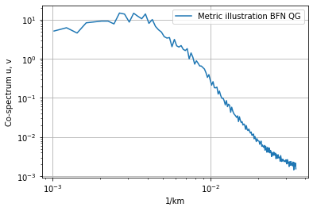

# Velocity metrics package illustration: Run spectrum 

## Agulhas, BFN-QG
 

***
**Authors:** Datlas <br>
**Copyright:** 2024 Datlas <br>
**License:** MIT

<div class="alert alert-block alert-success">
<h1><center>Agulhas: BFNQG currents maps</center></h1>
 <h5><center> The notebook aims to illustrate how to run the velocity metrics. Here, the example uses surface current maps produced by the BFN-QG in the Agulhas region.</center></h5>


```python
import velocity_metrics.spectrum.spectrum as spectrum 
```

# Parameters

### Output directory


```python
outputdir = '../results/metrics_illustration/'
```

### Evaluated maps parameters


```python
path_dict_product =   'data_type_metric_illustration_bfnqg.json' 

depth = 0
```

### Region parameters


```python
path_dict_region = 'region_metric_illustration_Agulhas.json'
```

# 1. Compute spectrum 


```python
dic_spectrum = spectrum.run([path_dict_product], path_dict_region, depth, output_dir= outputdir)

```

    Percent: [#############################-] 96.77%, , 

# 2. Plot spectrum 


```python
name_plot = 'Spectrum_metric_illustration_BFNQG.png'

from glob import glob
list_spectrum_pickles = glob(outputdir+'spectrum_BFNQG_region_metric_illustration_Agulhas*')

spectrum.plot(list_spectrum_pickles,
                      outfile=outputdir+name_plot)
```




