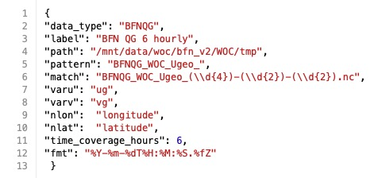

# Input specification

  
 

  

Once you have [installed the data challenge](getstarted_install.md) and [downloaded the data](getstarted_data.md), you can now evaluate your maps. Although, you might want to check first that your sea surface currents maps respect a certain format. You can then scroll through the different metrics, checking the DUACS evaluation notebooks as example. 

  

## Maps format

The evaluated maps must be provided as netcdf files that contain: 
- `latitude`, `longitude` and `time` dimensions.  .
- for currents, a meridional and a zonal currents variable `u` and `v`.

Note that the names of the variables will be specified in the dictionnary and can differ from the example names above. 
   
### Example

  

## Json dictionnary

### Example 

 
  