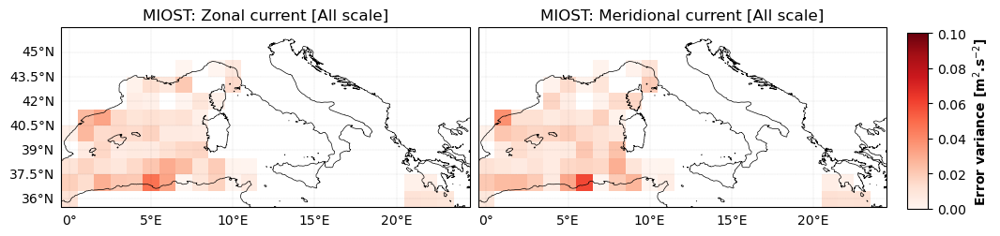
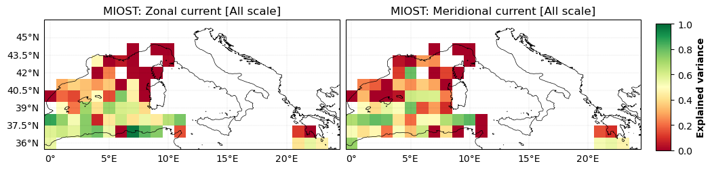

# MIOST 

 

Multi-scale interpolation (MIOST) combines ocean altimetry data along the track into continuous grids in time and space. Like the DUACS mapping system, it is based on a linear optimal interpolation scheme, with a different level of definition of the covariance functions. For this experimental product, only covariance functions representative of mesoscale geostrophic variability have been taken into account.

 

## Current magnitude movie 
   
 

<video controls width="600">
  <source src="../_static/movie_MIOST_Mediterranean_uv.mp4" type="video/mp4" />  
</video>

 

 
 

 

## Zonal and Meridional current error and explained variance
 

  

|  | 
|   |
|----|

 
 

 

## Lagrangian cumulative distance 
 
   