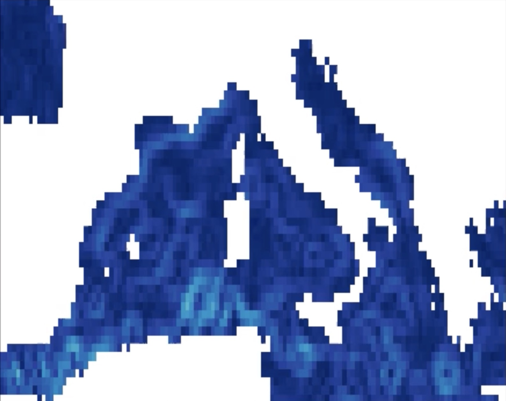

# Data challenge setup

 

 

## Agulhas region 

  

 

 
### Period 

- **Year 2019** 
 
### Area  

- Longitude minimum: 14°E
- Longitude maximum: 35°E
- Latitude minimum: 45°S
- Latitude maximum: 30°S

### Dynamical specificities: 

Strongly geostrophic region. 

 
 
### Independant evaluation data  

- CMEMS drifters currents and trajectories. Seviri SST fronts.

### Products: 
<ul>  
    <li> WOC Global Inertial (0m and 15m) </li>  
    <li> WOC BFN-QG (15m) </li>
    <li> GlobCurrent Geostrophic (15m) </li>
    <li> GlobCurrent Total (0m and 15m) </li>
    <li> NeurOST (15m) </li>
</ul> 

 
 
 
## Gulf Stream setup

  

  

 
### Period 

- **Year 2019** 
 
### Area  

- Longitude minimum: 80°W
- Longitude maximum: 10°W
- Latitude minimum: 25°N
- Latitude maximum: 50°N
### Dynamical specificities: 

High variability region with mixed geostrophic and ageostrophic dynamics.
      
    
### Independant evaluation data   

- CMEMS drifters currents and trajectories.

### Products: 
<ul>  
    <li> WOC Global Inertial (0m and 15m) </li>  
    <li> WOC Omega-3D (0m and 15m)</li> 
    <li> WOC SST-SSH-NAtl2D (15m) </li>
    <li> GlobCurrent Geostrophic (15m) </li>
    <li> GlobCurrent Total (0m and 15m) </li>
    <li> NeurOST (15m) </li>
</ul> 
   

 
 
 
## Mediterranean Sea setup 

  

 

 
### Period 

- **Year 2019** 
 
### Area  

- Longitude minimum: 5°W
- Longitude maximum: 25°E
- Latitude minimum: 35°N
- Latitude maximum: 47°N
  

### Dynamical specificities: 

A quasi-closed basin with strong ageostrophic dynamics and vertical shear.
      
    
### Independant evaluation data  

- CMEMS drifters currents and trajectories. 

###  Products: 
<ul> 
    <li> WOC dADR-SR (15m) </li> 
    <li> WOC Global Inertial (15m) </li> 
    <li> GlobCurrent Geostrophic (15m) </li> 
    <li> NeurOST (15m) </li> 
 </ul> 

 
 
 