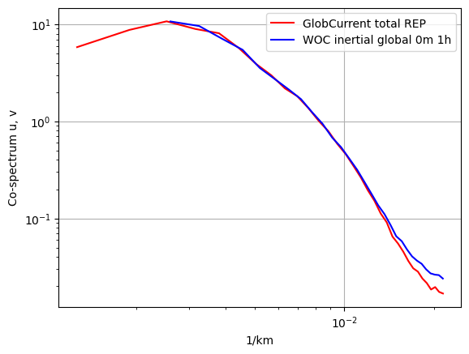
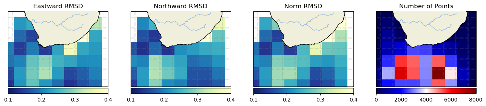
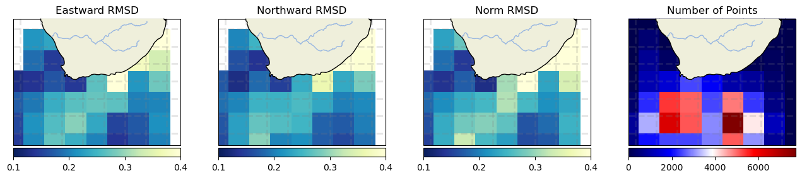
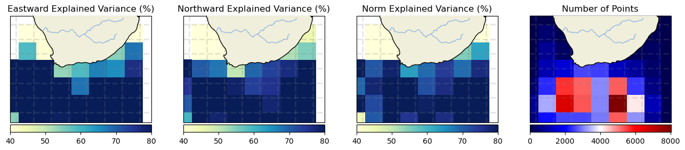
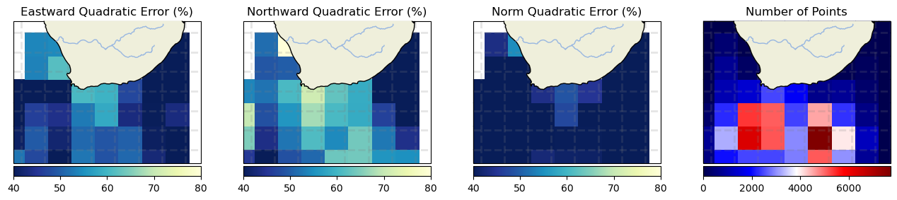
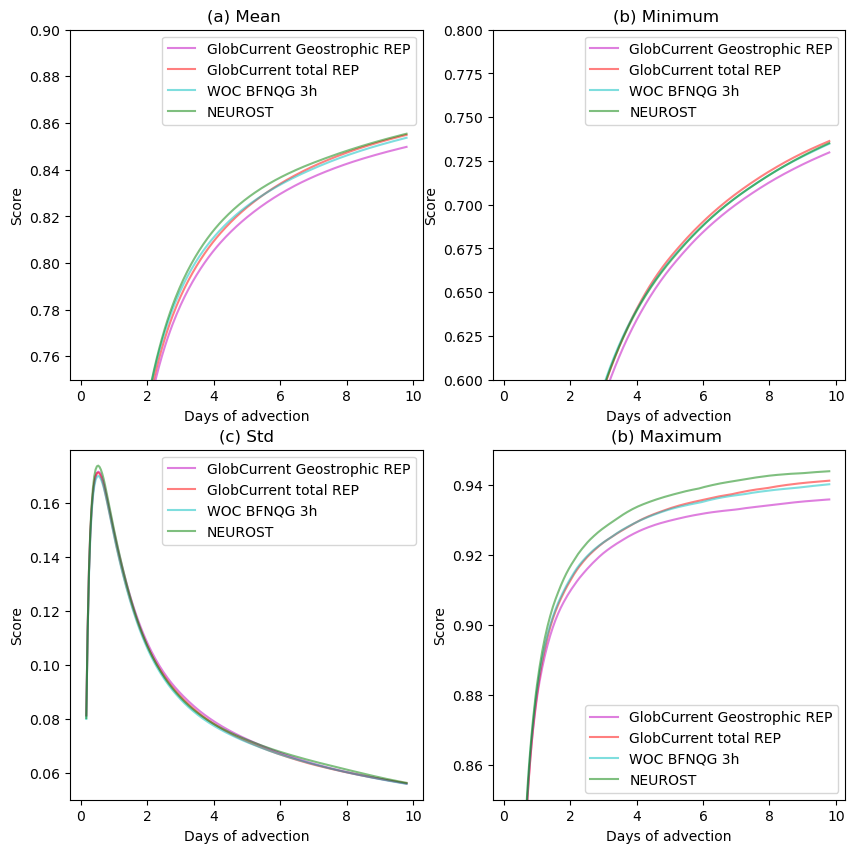

# Product comparison

 

 

<h1>
 <u> Agulhas results </u> 
</h1>  

## <u> Compared products </u> 

<h3>
    At 00m 
     
    <ul>   
        <li> GlobCurrent Total </li> 
        <li> WOC inertial global 0m </li>
    </ul>  
     
    At 15m 
     
    <ul>  
        <li> GlobCurrent Geostrophic </li> 
        <li> GlobCurrent Total </li>
        <li> WOC BFN-QG </li>
        <li> WOC inertial global 15m </li>
        <li> NeurOST </li>
    </ul>  

</h3>

 

 

## <u> 1. Spectrum </u> 

 

<h2>At 0m</h2>

 

<h2>At 15m</h2>

 

 

## <u> 2. Eulerian RMS </u>

 

<h2>At 0m</h2>

 

<h3>Mean error</h3>

<table width=100%>
<tr>
<td><b>Mean</b></td>
<td>Norm Quadratic Error (%)</td>
<td>Norm Correlation</td>
<td>Norm Explained Variance (%)</td>
<td>Norm RMSD</td>
<td>Number of Points</td>
</tr>
<tr>
<td><b>GlobCurrent Total</b></td>
<td>36.938</td>
<td>0.799</td>
<td>68.680</td>
<td>0.244</td>
<td>37440.000</td>
</tr>
<tr>
<td><b>WOC inertial global 00m 1h</b></td>
<td>34.724</td>
<td>0.812</td>
<td>71.705</td>
<td>0.230</td>
<td>37440.000</td>
</tr>
</table>

 

 

<h3>Standard deviation error</h3>

<table width=100%>
<tr>
<td><b>STD</b></td>
<td>Direction difference</td>
<td>Number of Points</td>
</tr>
<tr>
<td><b>GlobCurrents Total</b></td>
<td>43.497</td>
<td>37440.000</td>
</tr>
<tr>
<td><b>WOC inertial global 00m 1h</b></td>
<td>43.501</td>
<td>37440.000</td>
</tr>
</table>

 

<h3>Binned plots</h3>

    
    

 
<b>Results for diagnostic RMSD</b>

<b>GlobCurrents Geostrophic<b>

<b>GlobCurrents Total<b>

<b>WOC inertial global 15m 1h<b>

<b>WOC BFN-QG 3h<b>

<b>NeurOST<b>

    
    

 
<b>Results for diagnostic Correlation</b>

<b>GlobCurrents Geostrophic<b>

<b>GlobCurrents Total<b>

<b>WOC inertial global 15m 1h<b>

<b>WOC BFN-QG 3h<b>

<b>NeurOST<b>

    
    

 
<b>Results for diagnostic Explained Variance (%)</b>

<b>GlobCurrents Geostrophic<b>

<b>GlobCurrents Total<b>

<b>WOC inertial global 15m 1h<b>

<b>WOC BFN-QG 3h<b>

<b>NeurOST<b>

    
    

 
<b>Results for diagnostic Quadratic Error (%)</b>

<b>GlobCurrents Geostrophic<b>

<b>GlobCurrents Total<b>

<b>WOC inertial global 15m 1h<b>

<b>WOC BFN-QG 3h<b>

<b>NeurOST<b>

 

<h2>At 15m</h2>

 

<h3>Mean error</h3>

<table width=100%>
<tr>
<td><b>Mean</b></td>
<td>Norm Quadratic Error (%)</td>
<td>Norm Correlation</td>
<td>Norm Explained Variance (%)</td>
<td>Norm RMSD</td>
<td>Number of Points</td>
</tr>
<tr>
<td><b>GlobCurrent Geostrophic</b></td>
<td>37.299</td>
<td>0.829</td>
<td>69.561</td>
<td>0.243</td>
<td>44751.000</td>
</tr>
<tr>
<td><b>GlobCurrent Total</b></td>
<td>36.555</td>
<td>0.835</td>
<td>69.632</td>
<td>0.238</td>
<td>43190.000</td>
</tr>
<tr>
<td><b>WOC inertial global 15m 1h</b></td>
<td>35.879</td>
<td>0.835</td>
<td>69.976</td>
<td>0.233</td>
<td>43190.000</td>
</tr>
<tr>
<td><b>WOC BFN-QG 3h</b></td>
<td>36.708</td>
<td>0.837</td>
<td>69.562</td>
<td>0.239</td>
<td>43200.000</td>
</tr>
<tr>
<td><b>NeurOST</b></td>
<td>36.237</td>
<td>0.848</td>
<td>82.632</td>
<td>0.236</td>
<td>44738.000</td>
</tr>
</table>

 

 

<h3>Standard deviation error</h3>

<table width=100%>
<tr>
<td><b>STD</b></td>
<td>Direction difference</td>
<td>Number of Points</td>
</tr>
<tr>
<td><b>GlobCurrent Geostrophic</b></td>
<td>42.670</td>
<td>44751.000</td>
</tr>
<tr>
<td><b>GlobCurrent Total</b></td>
<td>42.329</td>
<td>43190.000</td>
</tr>
<tr>
<td><b>WOC inertial global 15m 1h</b></td>
<td>42.313</td>
<td>43190.000</td>
</tr>
<tr>
<td><b>WOC BFN-QG 3h</b></td>
<td>43.488</td>
<td>43200.000</td>
</tr>
<tr>
<td><b>NeurOST</b></td>
<td>43.268</td>
<td>44738.000</td>
</tr>
</table>

 

<h3>Binned plots</h3>

    
    

 
<b>Results for diagnostic RMSD</b>

<b>GlobCurrents Geostrophic<b>

<b>GlobCurrents Total<b>

<b>WOC inertial global 15m 1h<b>

<b>WOC BFN-QG 3h<b>

<b>NeurOST<b>

    
    

 
<b>Results for diagnostic Correlation</b>

<b>GlobCurrents Geostrophic<b>

<b>GlobCurrents Total<b>

<b>WOC inertial global 15m 1h<b>

<b>WOC BFN-QG 3h<b>

<b>NeurOST<b>

    
    

 
<b>Results for diagnostic Explained Variance (%)</b>

<b>GlobCurrents Geostrophic<b>

<b>GlobCurrents Total<b>

<b>WOC inertial global 15m 1h<b>

<b>WOC BFN-QG 3h<b>

<b>NeurOST<b>

    
    

 
<b>Results for diagnostic Quadratic Error (%)</b>

<b>GlobCurrents Geostrophic<b>

<b>GlobCurrents Total<b>

<b>WOC inertial global 15m 1h<b>

<b>WOC BFN-QG 3h<b>

<b>NeurOST<b>

 

 

## <u> 3. Lagrangian Cumulative Distance</u>

 

<h2>At 0m</h2>

    <Figure size 640x480 with 0 Axes>

 

<h2>At 15m</h2>

    <Figure size 640x480 with 0 Axes>

 

 

## <u>4. Fronts and currents consistency</u>

    (<Figure size 2500x1500 with 30 Axes>,
     <Figure size 2500x2500 with 40 Axes>,
     <Figure size 600x500 with 2 Axes>)

