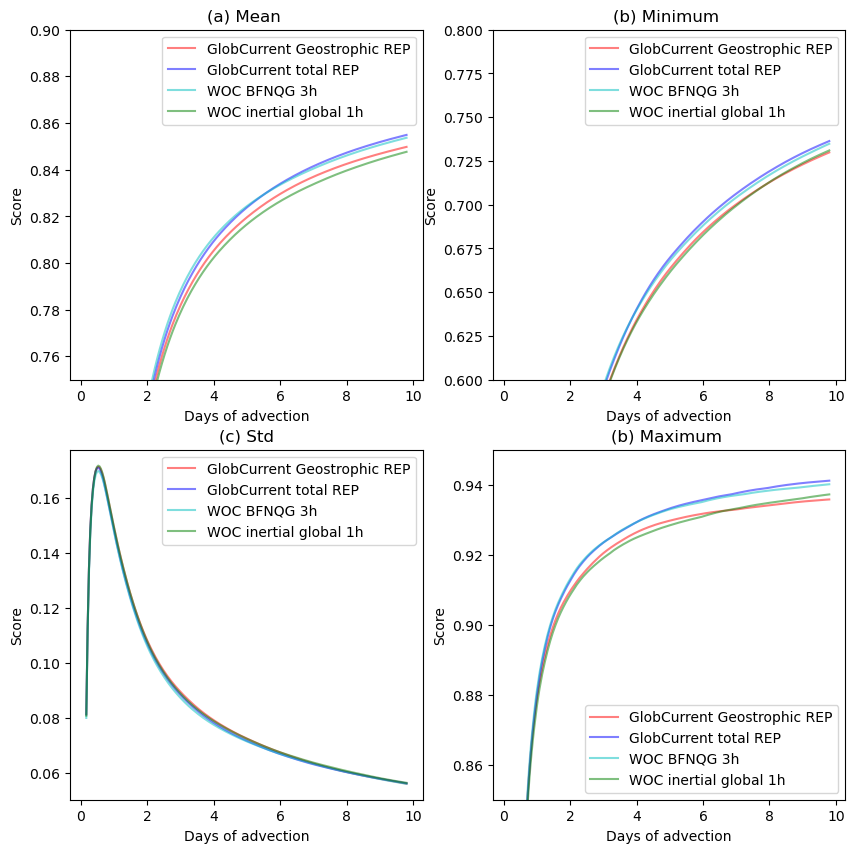
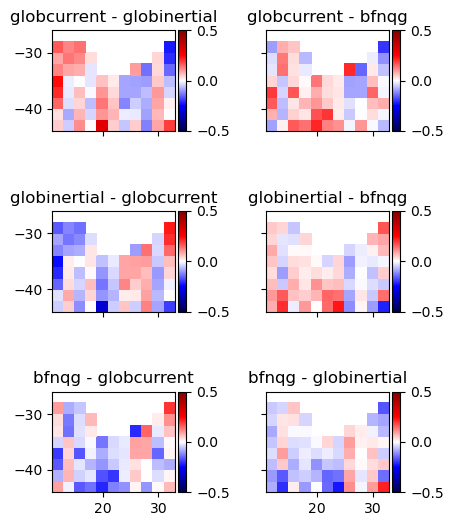
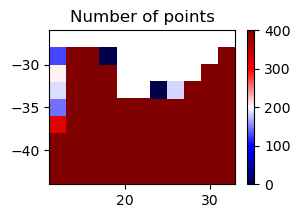

# Product comparison

 

 

<h1>
 <u> Agulhas results </u> 
</h1>  

## <u> Compared products </u> 

<h3>
    <ul>  
        <li> GlobCurrent Geostrophic </li> 
        <li> GlobCurrent Total </li>
        <li> WOC BFN-QG </li>
        <li> WOC inertial global </li>
    </ul>  

</h3>

 

 

## <u> 1. Spectrum </u> 

 

<h2>At 0m</h2>

 

<h2>At 15m</h2>

 

 

## <u> 2. Eulerian RMS </u>

 

<h2>At 0m</h2>

 

<h3>Mean error</h3>

<table width=100%>
<tr>
<td><b>Mean</b></td>
<td>Norm Quadratic Error (%)</td>
<td>Norm Explained Variance (%)</td>
<td>Norm Correlation</td>
<td>Norm RMSD</td>
<td>Number of Points</td>
</tr>
<tr>
<td><b>GlobCurrent Geostrophic</b></td>
<td>42.323</td>
<td>84.776</td>
<td>0.746</td>
<td>0.280</td>
<td>37269.000</td>
</tr>
<tr>
<td><b>GlobCurrent Total</b></td>
<td>36.938</td>
<td>86.030</td>
<td>0.799</td>
<td>0.244</td>
<td>37440.000</td>
</tr>
<tr>
<td><b>WOC inertial global 1h</b></td>
<td>39.696</td>
<td>82.378</td>
<td>0.771</td>
<td>0.262</td>
<td>37440.000</td>
</tr>
<tr>
<td><b>WOC BFN-QG 3h</b></td>
<td>41.997</td>
<td>84.175</td>
<td>0.756</td>
<td>0.278</td>
<td>37447.000</td>
</tr>
</table>

 

 

<h3>Standard deviation error</h3>

<table width=100%>
<tr>
<td><b>STD</b></td>
<td>Direction difference</td>
<td>Number of Points</td>
</tr>
<tr>
<td><b>GlobCurrents Geostrophic</b></td>
<td>43.893</td>
<td>37269.000</td>
</tr>
<tr>
<td><b>GlobCurrents Total</b></td>
<td>43.497</td>
<td>37440.000</td>
</tr>
<tr>
<td><b>WOC inertial global 1h</b></td>
<td>43.982</td>
<td>37440.000</td>
</tr>
<tr>
<td><b>WOC BFN-QG 3h</b></td>
<td>44.368</td>
<td>37447.000</td>
</tr>
</table>

 

<h2>At 15m</h2>

 

<h3>Mean error</h3>

<table width=100%>
<tr>
<td><b>Mean</b></td>
<td>Norm Quadratic Error (%)</td>
<td>Norm Explained Variance (%)</td>
<td>Norm Correlation</td>
<td>Norm RMSD</td>
<td>Number of Points</td>
</tr>
<tr>
<td><b>GlobCurrent Geostrophic</b></td>
<td>37.278</td>
<td>83.287</td>
<td>0.830</td>
<td>0.242</td>
<td>42955.000</td>
</tr>
<tr>
<td><b>GlobCurrent Total</b></td>
<td>36.555</td>
<td>82.787</td>
<td>0.835</td>
<td>0.238</td>
<td>43190.000</td>
</tr>
<tr>
<td><b>WOC inertial global 1h</b></td>
<td>38.210</td>
<td>80.382</td>
<td>0.805</td>
<td>0.248</td>
<td>43190.000</td>
</tr>
<tr>
<td><b>WOC BFN-QG 3h</b></td>
<td>36.708</td>
<td>81.870</td>
<td>0.837</td>
<td>0.239</td>
<td>43200.000</td>
</tr>
</table>

 

 

<h3>Standard deviation error</h3>

<table width=100%>
<tr>
<td><b>STD</b></td>
<td>Direction difference</td>
<td>Number of Points</td>
</tr>
<tr>
<td><b>GlobCurrent Geostrophic</b></td>
<td>42.687</td>
<td>42955.000</td>
</tr>
<tr>
<td><b>GlobCurrent Total</b></td>
<td>42.329</td>
<td>43190.000</td>
</tr>
<tr>
<td><b>WOC inertial global 1h</b></td>
<td>42.573</td>
<td>43190.000</td>
</tr>
<tr>
<td><b>WOC BFN-QG 3h</b></td>
<td>43.488</td>
<td>43200.000</td>
</tr>
</table>

 

 

## <u> 3. Lagrangian Cumulative Distance</u>

 

<h2>At 0m</h2>

    <Figure size 640x480 with 0 Axes>

 

<h2>At 15m</h2>

    <Figure size 640x480 with 0 Axes>

 

 

## <u>4. Fronts and currents consistency</u>

    (<Figure size 600x600 with 18 Axes>,
     <Figure size 600x600 with 12 Axes>,
     <Figure size 300x200 with 2 Axes>)

