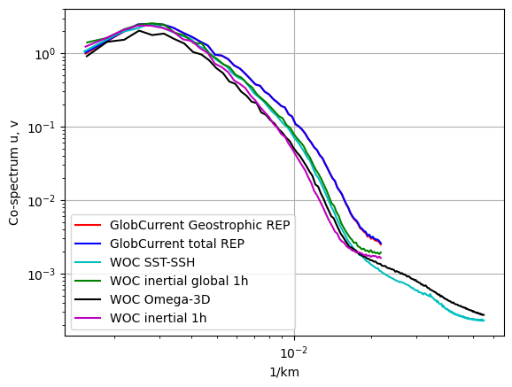
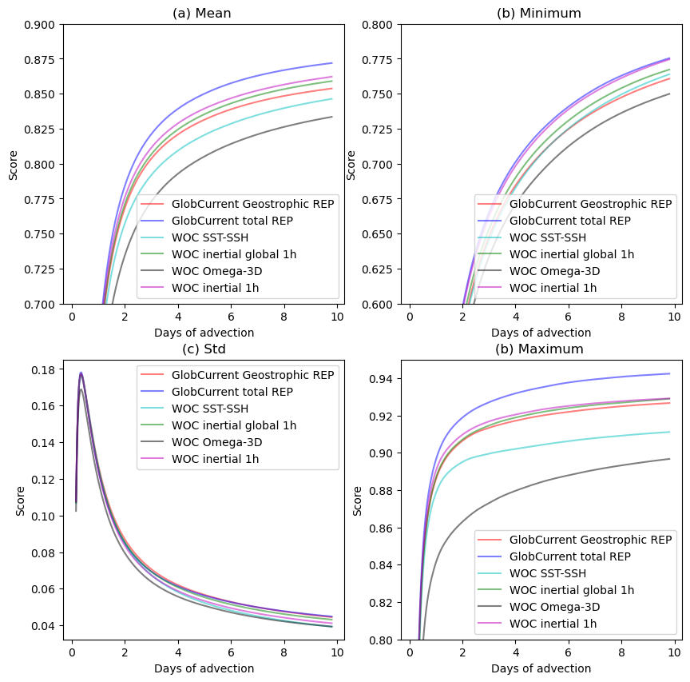
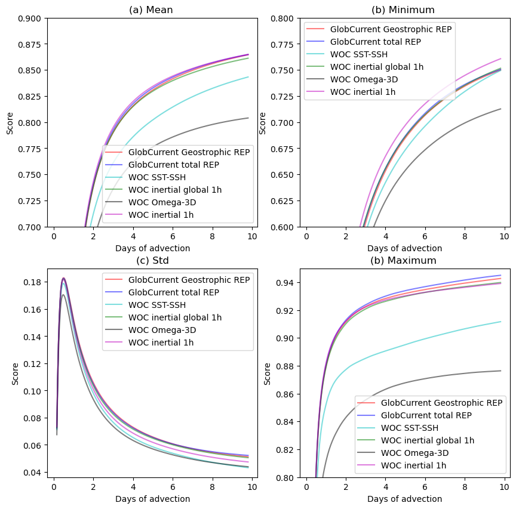

# Product comparison

 

 

<h1>
 <u> Gulf Stream results </u> 
</h1>  

## <u> Compared products </u> 

<h3>
    <ul>  
        <li> GlobCurrent Geostrophic </li> 
        <li> GlobCurrent Total </li>
        <li> WOC SST-SSH </li>
        <li> WOC inertial global </li>
        <li> WOC Omega-3D  </li>
        <li> WOC inertial (North Atlantic)  </li>
    </ul>  

</h3>
  

    <Figure size 640x480 with 0 Axes>

    <Figure size 640x480 with 0 Axes>

    <Figure size 640x480 with 0 Axes>

    <Figure size 640x480 with 0 Axes>

    <Figure size 640x480 with 0 Axes>

 

 

## <u> 1. Spectrum </u> 

 

<h2>At 0m</h2>

 

<h2>At 15m</h2>

 

 

## <u> 2. Eulerian RMS </u>

 

<h2>At 0m</h2>

 

<h3>Mean error</h3>

<table width=100%>
<tr>
<td><b>Mean</b></td>
<td>Norm Quadratic Error (%)</td>
<td>Norm Explained Variance (%)</td>
<td>Norm Correlation</td>
<td>Norm RMSD</td>
<td>Number of Points</td>
</tr>
<tr>
<td><b>GlobCurrent Geostrophic</b></td>
<td>40.177</td>
<td>83.118</td>
<td>0.781</td>
<td>0.287</td>
<td>102578.000</td>
</tr>
<tr>
<td><b>GlobCurrent Total</b></td>
<td>36.575</td>
<td>84.961</td>
<td>0.813</td>
<td>0.262</td>
<td>103022.000</td>
</tr>
<tr>
<td><b>WOC SST-SSH</b></td>
<td>43.479</td>
<td>81.145</td>
<td>0.750</td>
<td>0.312</td>
<td>93656.000</td>
</tr>
<tr>
<td><b>WOC inertial global 1h</b></td>
<td>40.345</td>
<td>81.361</td>
<td>0.776</td>
<td>0.289</td>
<td>103008.000</td>
</tr>
<tr>
<td><b>WOC Omega-3D</b></td>
<td>42.604</td>
<td>79.880</td>
<td>0.757</td>
<td>0.306</td>
<td>93656.000</td>
</tr>
<tr>
<td><b>WOC inertial 1h</b></td>
<td>41.659</td>
<td>76.780</td>
<td>0.773</td>
<td>0.299</td>
<td>103274.000</td>
</tr>
</table>

 

 

<h3>Standard deviation error</h3>

<table width=100%>
<tr>
<td><b>STD</b></td>
<td>Direction difference</td>
<td>Number of Points</td>
</tr>
<tr>
<td><b>GlobCurrent Geostrophic</b></td>
<td>42.983</td>
<td>102578.000</td>
</tr>
<tr>
<td><b>GlobCurrent Total</b></td>
<td>42.638</td>
<td>103022.000</td>
</tr>
<tr>
<td><b>WOC SST-SSH</b></td>
<td>44.358</td>
<td>93656.000</td>
</tr>
<tr>
<td><b>WOC inertial global 1h</b></td>
<td>42.984</td>
<td>103008.000</td>
</tr>
<tr>
<td><b>WOC Omega-3D</b></td>
<td>44.510</td>
<td>93656.000</td>
</tr>
<tr>
<td><b>WOC inertial 1h</b></td>
<td>43.075</td>
<td>103274.000</td>
</tr>
</table>

 

<h2>At 15m</h2>

 

<h3>Mean error</h3>

<table width=100%>
<tr>
<td><b>Mean</b></td>
<td>Norm Quadratic Error (%)</td>
<td>Norm Explained Variance (%)</td>
<td>Norm Correlation</td>
<td>Norm RMSD</td>
<td>Number of Points</td>
</tr>
<tr>
<td><b>GlobCurrent Geostrophic</b></td>
<td>52.787</td>
<td>90.749</td>
<td>0.630</td>
<td>0.266</td>
<td>49819.000</td>
</tr>
<tr>
<td><b>GlobCurrent Total</b></td>
<td>51.551</td>
<td>89.859</td>
<td>0.639</td>
<td>0.260</td>
<td>50016.000</td>
</tr>
<tr>
<td><b>WOC SST-SSH</b></td>
<td>57.433</td>
<td>88.037</td>
<td>0.571</td>
<td>0.286</td>
<td>43880.000</td>
</tr>
<tr>
<td><b>WOC inertial global 1h</b></td>
<td>52.508</td>
<td>88.759</td>
<td>0.619</td>
<td>0.265</td>
<td>50016.000</td>
</tr>
<tr>
<td><b>WOC Omega-3D</b></td>
<td>57.558</td>
<td>81.021</td>
<td>0.558</td>
<td>0.287</td>
<td>43880.000</td>
</tr>
<tr>
<td><b>WOC inertial 1h</b></td>
<td>52.616</td>
<td>84.120</td>
<td>0.619</td>
<td>0.268</td>
<td>50176.000</td>
</tr>
</table>

 

 

<h3>Standard deviation error</h3>

<table width=100%>
<tr>
<td><b>STD</b></td>
<td>Direction difference</td>
<td>Number of Points</td>
</tr>
<tr>
<td><b>GlobCurrent Geostrophic</b></td>
<td>42.956</td>
<td>49819.000</td>
</tr>
<tr>
<td><b>GlobCurrent Total</b></td>
<td>42.721</td>
<td>50016.000</td>
</tr>
<tr>
<td><b>WOC SST-SSH</b></td>
<td>43.550</td>
<td>43880.000</td>
</tr>
<tr>
<td><b>WOC inertial global 1h</b></td>
<td>43.052</td>
<td>50016.000</td>
</tr>
<tr>
<td><b>WOC Omega-3D</b></td>
<td>43.676</td>
<td>43880.000</td>
</tr>
<tr>
<td><b>WOC inertial 1h</b></td>
<td>43.020</td>
<td>50176.000</td>
</tr>
</table>

 

 

## <u> 3. Lagrangian Cumulative Distance</u> 

 

<h2>At 0m</h2>

    <Figure size 640x480 with 0 Axes>

 

<h2>At 15m</h2>

    <Figure size 640x480 with 0 Axes>

