# Gulf Stream region

 

 

<h1>
 <u> Gulf Stream results </u> 
</h1>  

## <u> Compared products </u> 

<h3>
At 0m 
</h3> 
    <ul>   
        <li> GlobCurrent Total </li> 
        <li> WOC inertial global 0m </li>
        <li> WOC Omega-3D  </li>
    </ul>  

<h3>
At 15m 
</h3> 
    <ul>  
        <li> GlobCurrent Geostrophic </li> 
        <li> GlobCurrent Total </li>
        <li> WOC SST-SSH </li>
        <li> WOC Omega-3D  </li>
        <li> WOC inertial global 15m </li>
        <li> NeurOST </li>
        <li> OSCAR </li>
    </ul>  
  

 

 

<h2><u> 1. Spectrum </u></h2>

    
<h2> ▶️ At 0m</h2>

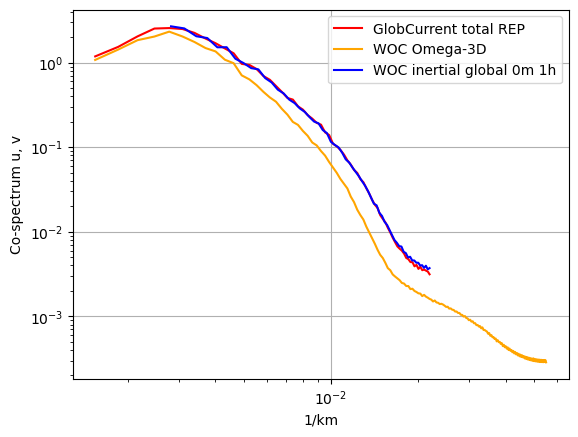

 

    
<h2> ▶️ At 15m</h2> 

 

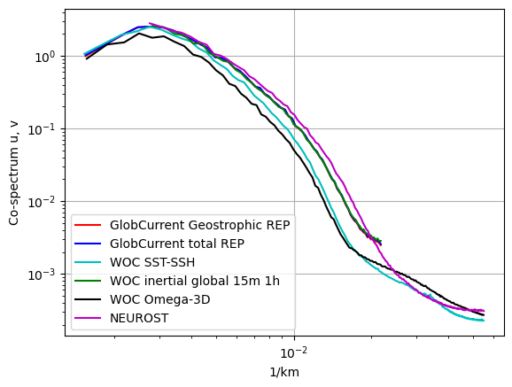

 

 

 

<h1><u> 2. Eulerian RMS </u></h1>

 
    
<h2> ▶️ At 0m</h2>

 

<h3>Norm errors</h3>

<table width=100%>
<tr>
<td><b>Mean</b></td>
<td>Norm Quadratic Error (%)</td>
<td>Norm Correlation</td>
<td>Norm Explained Variance (%)</td>
<td>Norm RMSD</td>
<td>Number of Points</td>
</tr>
<tr>
<td><b>GlobCurrent Total</b></td>
<td>36.575</td>
<td>0.813</td>
<td>69.040</td>
<td>0.262</td>
<td>103022.000</td>
</tr>
<tr>
<td><b>WOC-Omega3D</b></td>
<td>42.604</td>
<td>0.757</td>
<td>60.487</td>
<td>0.306</td>
<td>93656.000</td>
</tr>
<tr>
<td><b>WOC inertial global 00m</b></td>
<td>35.563</td>
<td>0.816</td>
<td>70.314</td>
<td>0.254</td>
<td>103008.000</td>
</tr>
</table>

 

<h3>Eastward errors</h3>

<table width=100%>
<tr>
<td><b>Mean</b></td>
<td>Eastward Quadratic Error (%)</td>
<td>Eastward Correlation</td>
<td>Eastward Explained Variance (%)</td>
<td>Eastward RMSD</td>
<td>Number of Points</td>
</tr>
<tr>
<td><b>GlobCurrent Total</b></td>
<td>46.839</td>
<td>0.870</td>
<td>73.374</td>
<td>0.246</td>
<td>103022.000</td>
</tr>
<tr>
<td><b>WOC-Omega3D</b></td>
<td>50.965</td>
<td>0.843</td>
<td>65.576</td>
<td>0.273</td>
<td>93656.000</td>
</tr>
<tr>
<td><b>WOC inertial global 00m</b></td>
<td>45.721</td>
<td>0.875</td>
<td>76.379</td>
<td>0.240</td>
<td>103008.000</td>
</tr>
</table>

 

<h3>Northward errors</h3>

<table width=100%>
<tr>
<td><b>Mean</b></td>
<td>Northward Quadratic Error (%)</td>
<td>Northward Correlation</td>
<td>Northward Explained Variance (%)</td>
<td>Northward RMSD</td>
<td>Number of Points</td>
</tr>
<tr>
<td><b>GlobCurrent Total</b></td>
<td>52.415</td>
<td>0.849</td>
<td>71.322</td>
<td>0.254</td>
<td>103022.000</td>
</tr>
<tr>
<td><b>WOC-Omega3D</b></td>
<td>61.449</td>
<td>0.788</td>
<td>61.165</td>
<td>0.294</td>
<td>93656.000</td>
</tr>
<tr>
<td><b>WOC inertial global 00m</b></td>
<td>51.101</td>
<td>0.858</td>
<td>74.310</td>
<td>0.248</td>
<td>103008.000</td>
</tr>
</table>

 

<h3>Standard deviation error</h3>

<table width=100%>
<tr>
<td><b>STD</b></td>
<td>Direction difference</td>
<td>Number of Points</td>
</tr>
<tr>
<td><b>GlobCurrent Total</b></td>
<td>42.638</td>
<td>103022.000</td>
</tr>
<tr>
<td><b>WOC-Omega3D</b></td>
<td>44.510</td>
<td>93656.000</td>
</tr>
<tr>
<td><b>WOC inertial global 00m</b></td>
<td>42.407</td>
<td>103008.000</td>
</tr>
</table>

 

<h3>Binned plots</h3>

    
    

 
</b>Results for diagnostic RMSD</b>

<b>GlobCurrents Total</b>

<b>WOC-Omega3D</b>

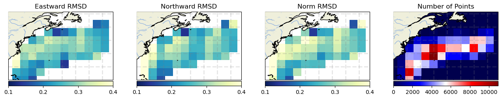

<b>WOC inertial global 00m</b>

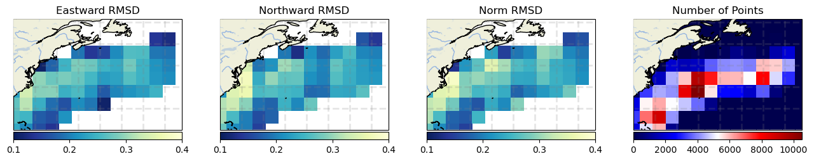

    
    

 
</b>Results for diagnostic Correlation</b>

<b>GlobCurrents Total</b>

<b>WOC-Omega3D</b>

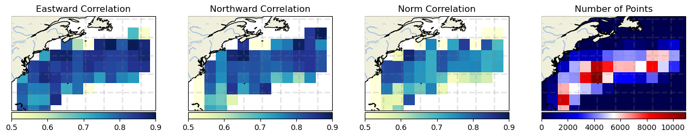

<b>WOC inertial global 00m</b>

    
    

 
</b>Results for diagnostic Explained Variance (%)</b>

<b>GlobCurrents Total</b>

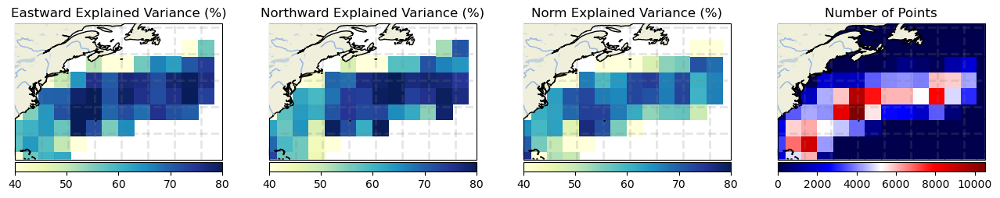

<b>WOC-Omega3D</b>

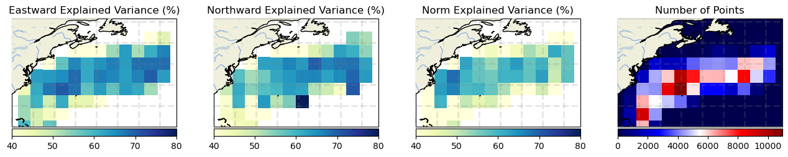

<b>WOC inertial global 00m</b>

    
    

 
</b>Results for diagnostic Quadratic Error (%)</b>

<b>GlobCurrents Total</b>

<b>WOC-Omega3D</b>

<b>WOC inertial global 00m</b>

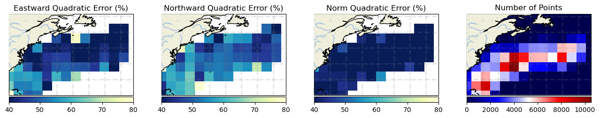

 

    
<h2> ▶️ At 15m</h2>

 

<h3>Norm errors</h3>

<table width=100%>
<tr>
<td><b>Mean</b></td>
<td>Norm Quadratic Error (%)</td>
<td>Norm Correlation</td>
<td>Norm Explained Variance (%)</td>
<td>Norm RMSD</td>
<td>Number of Points</td>
</tr>
<tr>
<td><b>GlobCurrent Geostrophic</b></td>
<td>52.812</td>
<td>0.630</td>
<td>57.154</td>
<td>0.266</td>
<td>51943.000</td>
</tr>
<tr>
<td><b>GlobCurrent Total</b></td>
<td>51.551</td>
<td>0.639</td>
<td>57.464</td>
<td>0.260</td>
<td>50016.000</td>
</tr>
<tr>
<td><b>WOC SST-SSH</b></td>
<td>57.433</td>
<td>0.571</td>
<td>50.292</td>
<td>0.286</td>
<td>43880.000</td>
</tr>
<tr>
<td><b>WOC inertial global 15m</b></td>
<td>50.764</td>
<td>0.646</td>
<td>58.337</td>
<td>0.256</td>
<td>50016.000</td>
</tr>
<tr>
<td><b>WOC Omega-3D</b></td>
<td>57.558</td>
<td>0.558</td>
<td>45.312</td>
<td>0.287</td>
<td>43880.000</td>
</tr>
<tr>
<td><b>NeurOST</b></td>
<td>50.832</td>
<td>0.690</td>
<td>66.189</td>
<td>0.256</td>
<td>51908.000</td>
</tr>
</table>

 

<h3>Eastward errors</h3>

<table width=100%>
<tr>
<td><b>Mean</b></td>
<td>Eastward Quadratic Error (%)</td>
<td>Eastward Correlation</td>
<td>Eastward Explained Variance (%)</td>
<td>Eastward RMSD</td>
<td>Number of Points</td>
</tr>
<tr>
<td><b>GlobCurrent Geostrophic</b></td>
<td>67.125</td>
<td>0.740</td>
<td>61.314</td>
<td>0.238</td>
<td>51943.000</td>
</tr>
<tr>
<td><b>GlobCurrent Total</b></td>
<td>66.044</td>
<td>0.749</td>
<td>62.690</td>
<td>0.235</td>
<td>50016.000</td>
</tr>
<tr>
<td><b>WOC SST-SSH</b></td>
<td>69.405</td>
<td>0.718</td>
<td>58.050</td>
<td>0.246</td>
<td>43880.000</td>
</tr>
<tr>
<td><b>WOC inertial global 15m</b></td>
<td>65.414</td>
<td>0.759</td>
<td>64.594</td>
<td>0.232</td>
<td>50016.000</td>
</tr>
<tr>
<td><b>WOC Omega-3D</b></td>
<td>68.148</td>
<td>0.729</td>
<td>53.346</td>
<td>0.241</td>
<td>43880.000</td>
</tr>
<tr>
<td><b>NeurOST</b></td>
<td>62.921</td>
<td>0.778</td>
<td>67.795</td>
<td>0.223</td>
<td>51908.000</td>
</tr>
</table>

 

<h3>Northward errors</h3>

<table width=100%>
<tr>
<td><b>Mean</b></td>
<td>Northward Quadratic Error (%)</td>
<td>Northward Correlation</td>
<td>Northward Explained Variance (%)</td>
<td>Northward RMSD</td>
<td>Number of Points</td>
</tr>
<tr>
<td><b>GlobCurrent Geostrophic</b></td>
<td>70.638</td>
<td>0.715</td>
<td>57.794</td>
<td>0.253</td>
<td>51943.000</td>
</tr>
<tr>
<td><b>GlobCurrent Total</b></td>
<td>69.609</td>
<td>0.724</td>
<td>59.215</td>
<td>0.249</td>
<td>50016.000</td>
</tr>
<tr>
<td><b>WOC SST-SSH</b></td>
<td>73.304</td>
<td>0.685</td>
<td>51.841</td>
<td>0.257</td>
<td>43880.000</td>
</tr>
<tr>
<td><b>WOC inertial global 15m</b></td>
<td>68.940</td>
<td>0.735</td>
<td>61.287</td>
<td>0.247</td>
<td>50016.000</td>
</tr>
<tr>
<td><b>WOC Omega-3D</b></td>
<td>76.700</td>
<td>0.654</td>
<td>48.572</td>
<td>0.269</td>
<td>43880.000</td>
</tr>
<tr>
<td><b>NeurOST</b></td>
<td>65.033</td>
<td>0.763</td>
<td>61.323</td>
<td>0.233</td>
<td>51908.000</td>
</tr>
</table>

 

<h3>Standard deviation error</h3>

<table width=100%>
<tr>
<td><b>STD</b></td>
<td>Direction difference</td>
<td>Number of Points</td>
</tr>
<tr>
<td><b>GlobCurrent Geostrophic</b></td>
<td>43.021</td>
<td>51943.000</td>
</tr>
<tr>
<td><b>GlobCurrent Total</b></td>
<td>42.721</td>
<td>50016.000</td>
</tr>
<tr>
<td><b>WOC SST-SSH</b></td>
<td>43.550</td>
<td>43880.000</td>
</tr>
<tr>
<td><b>WOC inertial global 15m</b></td>
<td>42.992</td>
<td>50016.000</td>
</tr>
<tr>
<td><b>WOC Omega-3D</b></td>
<td>43.676</td>
<td>43880.000</td>
</tr>
<tr>
<td><b>NeurOST</b></td>
<td>43.830</td>
<td>51908.000</td>
</tr>
</table>

 

<h3>Binned plots</h3>

    
    

 
<b>Results for diagnostic RMSD</b>

<b>GlobCurrents Total</b>

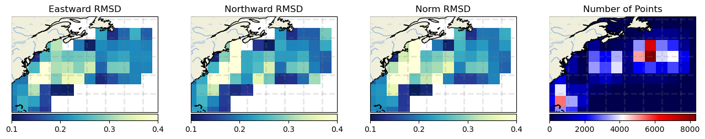

<b>GlobCurrents</b>

<b>WOC SST-SSH</b>

<b>WOC inertial global 1h</b>

<b>WOC Omega-3D</b>

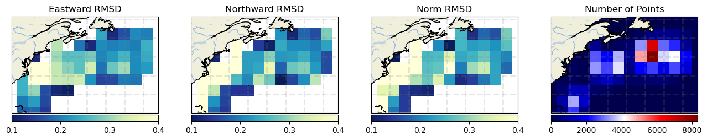

<b>NeurOST</b>

    
    

 
<b>Results for diagnostic Correlation</b>

<b>GlobCurrents Total</b>

<b>GlobCurrents</b>

<b>WOC SST-SSH</b>

<b>WOC inertial global 1h</b>

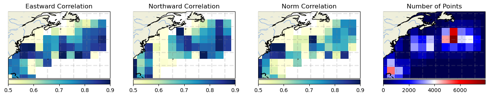

<b>WOC Omega-3D</b>

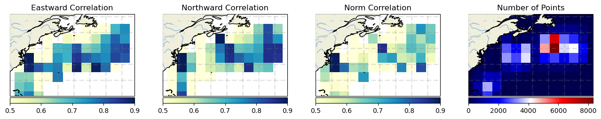

<b>NeurOST</b>

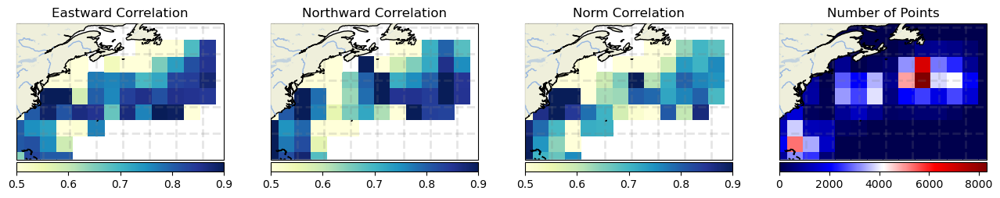

    
    

 
<b>Results for diagnostic Explained Variance (%)</b>

<b>GlobCurrents Total</b>

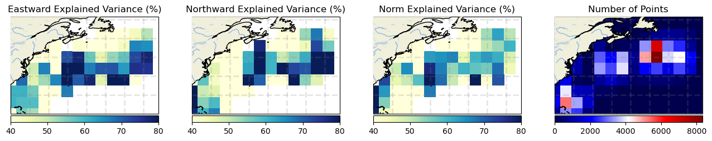

<b>GlobCurrents</b>

<b>WOC SST-SSH</b>

<b>WOC inertial global 1h</b>

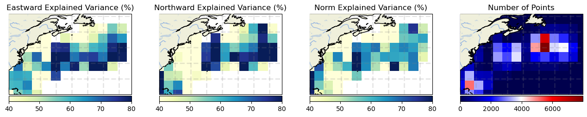

<b>WOC Omega-3D</b>

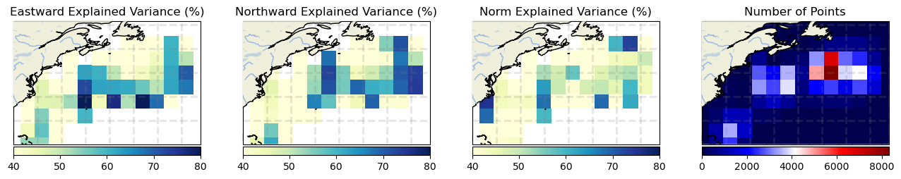

<b>NeurOST</b>

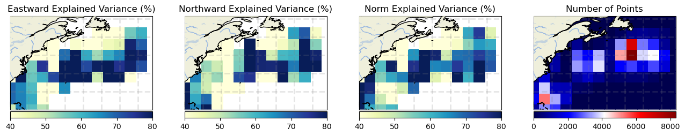

    
    

 
<b>Results for diagnostic Quadratic Error (%)</b>

<b>GlobCurrents Total</b>

<b>GlobCurrents</b>

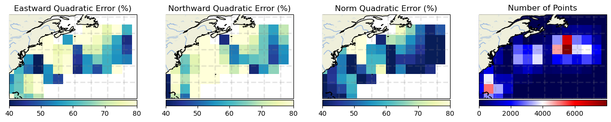

<b>WOC SST-SSH</b>

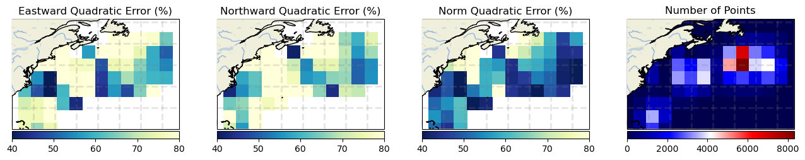

<b>WOC inertial global 1h</b>

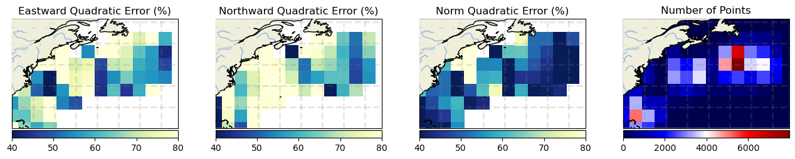

<b>WOC Omega-3D</b>

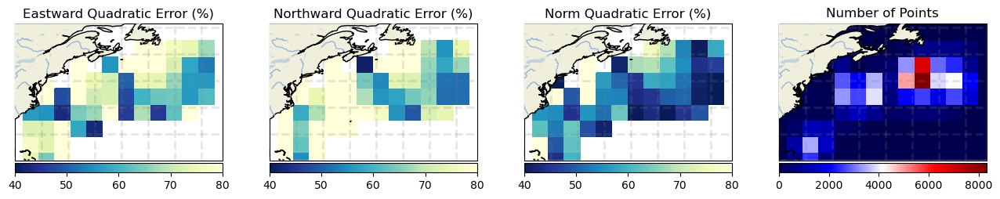

<b>NeurOST</b>

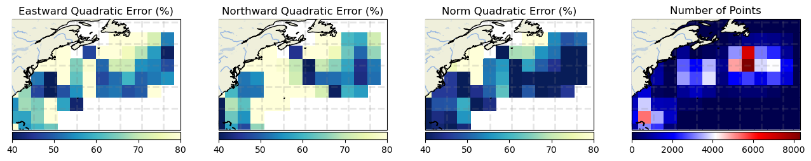

 

 

<h1><u> 3. Lagrangian Cumulative Distance</u></h1>

    
<h2> ▶️ At 0m</h2>

 

    <Figure size 640x480 with 0 Axes>

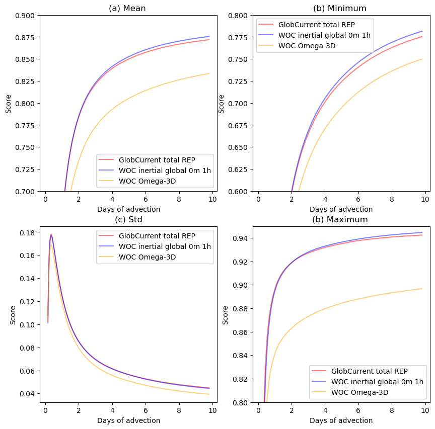

    
<h2> ▶️ At 15m</h2>

    <Figure size 640x480 with 0 Axes>

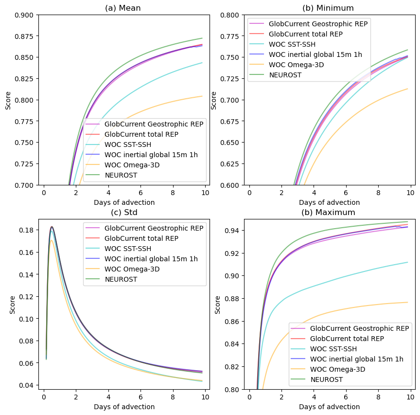

 

 

 
 
