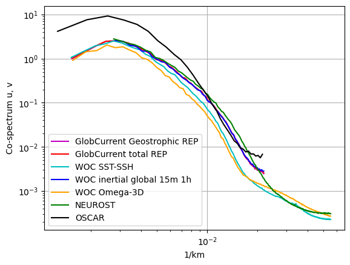

# Product comparison

 

 

<h1>
 <u> Gulf Stream results </u> 
</h1>  

## <u> Compared products </u> 

<h3>
    At 00m 
     
    <ul>   
        <li> GlobCurrent Total </li> 
        <li> WOC inertial global 0m </li>
        <li> WOC Omega-3D  </li>
    </ul>  
     
    At 15m 
     
    <ul>  
        <li> GlobCurrent Geostrophic </li> 
        <li> GlobCurrent Total </li>
        <li> WOC SST-SSH </li>
        <li> WOC Omega-3D  </li>
        <li> WOC inertial global 15m </li>
        <li> NeurOST </li>
    </ul>  

</h3>
  

 

 

## <u> 1. Spectrum </u> 

 

<h2>At 0m</h2>

 

<h2>At 15m</h2>

 

 

## <u> 2. Eulerian RMS </u>

 

<h2>At 0m</h2>

 

<h3>Mean error</h3>

<table width=100%>
<tr>
<td><b>Mean</b></td>
<td>Norm Quadratic Error (%)</td>
<td>Norm Correlation</td>
<td>Norm Explained Variance (%)</td>
<td>Norm RMSD</td>
<td>Number of Points</td>
</tr>
<tr>
<td><b>GlobCurrent Total</b></td>
<td>36.575</td>
<td>0.813</td>
<td>69.040</td>
<td>0.262</td>
<td>103022.000</td>
</tr>
<tr>
<td><b>WOC-Omega3D</b></td>
<td>42.604</td>
<td>0.757</td>
<td>60.487</td>
<td>0.306</td>
<td>93656.000</td>
</tr>
<tr>
<td><b>WOC inertial global 00m</b></td>
<td>35.563</td>
<td>0.816</td>
<td>70.314</td>
<td>0.254</td>
<td>103008.000</td>
</tr>
</table>

 

 

<h3>Standard deviation error</h3>

<table width=100%>
<tr>
<td><b>STD</b></td>
<td>Direction difference</td>
<td>Number of Points</td>
</tr>
<tr>
<td><b>GlobCurrent Total</b></td>
<td>42.638</td>
<td>103022.000</td>
</tr>
<tr>
<td><b>WOC-Omega3D</b></td>
<td>44.510</td>
<td>93656.000</td>
</tr>
<tr>
<td><b>WOC inertial global 00m</b></td>
<td>42.407</td>
<td>103008.000</td>
</tr>
</table>

 

<h3>Binned plots</h3>

    
    

<b>Results for diagnostic RMSD</b>

<b>GlobCurrents Total<b>

<b>WOC-Omega3D<b>

<b>WOC inertial global 00m<b>

    
    

<b>Results for diagnostic Correlation</b>

<b>GlobCurrents Total<b>

<b>WOC-Omega3D<b>

<b>WOC inertial global 00m<b>

    
    

<b>Results for diagnostic Explained Variance (%)</b>

<b>GlobCurrents Total<b>

<b>WOC-Omega3D<b>

<b>WOC inertial global 00m<b>

    
    

<b>Results for diagnostic Quadratic Error (%)</b>

<b>GlobCurrents Total<b>

<b>WOC-Omega3D<b>

<b>WOC inertial global 00m<b>

 

<h2>At 15m</h2>

 

<h3>Mean error</h3>

<table width=100%>
<tr>
<td><b>Mean</b></td>
<td>Norm Quadratic Error (%)</td>
<td>Norm Correlation</td>
<td>Norm Explained Variance (%)</td>
<td>Norm RMSD</td>
<td>Number of Points</td>
</tr>
<tr>
<td><b>GlobCurrent Geostrophic</b></td>
<td>52.812</td>
<td>0.630</td>
<td>57.154</td>
<td>0.266</td>
<td>51943.000</td>
</tr>
<tr>
<td><b>GlobCurrent Total</b></td>
<td>51.551</td>
<td>0.639</td>
<td>57.464</td>
<td>0.260</td>
<td>50016.000</td>
</tr>
<tr>
<td><b>WOC SST-SSH</b></td>
<td>57.433</td>
<td>0.571</td>
<td>50.292</td>
<td>0.286</td>
<td>43880.000</td>
</tr>
<tr>
<td><b>WOC inertial global 15m</b></td>
<td>50.764</td>
<td>0.646</td>
<td>58.337</td>
<td>0.256</td>
<td>50016.000</td>
</tr>
<tr>
<td><b>WOC Omega-3D</b></td>
<td>57.558</td>
<td>0.558</td>
<td>45.312</td>
<td>0.287</td>
<td>43880.000</td>
</tr>
<tr>
<td><b>NeurOST</b></td>
<td>50.832</td>
<td>0.690</td>
<td>66.189</td>
<td>0.256</td>
<td>51908.000</td>
</tr>
</table>

 

 

<h3>Standard deviation error</h3>

<table width=100%>
<tr>
<td><b>STD</b></td>
<td>Direction difference</td>
<td>Number of Points</td>
</tr>
<tr>
<td><b>GlobCurrent Geostrophic</b></td>
<td>43.021</td>
<td>51943.000</td>
</tr>
<tr>
<td><b>GlobCurrent Total</b></td>
<td>42.721</td>
<td>50016.000</td>
</tr>
<tr>
<td><b>WOC SST-SSH</b></td>
<td>43.550</td>
<td>43880.000</td>
</tr>
<tr>
<td><b>WOC inertial global 15m</b></td>
<td>42.992</td>
<td>50016.000</td>
</tr>
<tr>
<td><b>WOC Omega-3D</b></td>
<td>43.676</td>
<td>43880.000</td>
</tr>
<tr>
<td><b>NeurOST</b></td>
<td>43.830</td>
<td>51908.000</td>
</tr>
</table>

 

<h3>Binned plots</h3>

    
    

<b>Results for diagnostic RMSD</b>

<b>GlobCurrents Total<b>

<b>GlobCurrents<b>

<b>WOC SST-SSH<b>

<b>WOC inertial global 1h<b>

<b>WOC Omega-3D<b>

<b>NeurOST<b>

    
    

<b>Results for diagnostic Correlation</b>

<b>GlobCurrents Total<b>

<b>GlobCurrents<b>

<b>WOC SST-SSH<b>

<b>WOC inertial global 1h<b>

<b>WOC Omega-3D<b>

<b>NeurOST<b>

    
    

<b>Results for diagnostic Explained Variance (%)</b>

<b>GlobCurrents Total<b>

<b>GlobCurrents<b>

<b>WOC SST-SSH<b>

<b>WOC inertial global 1h<b>

<b>WOC Omega-3D<b>

<b>NeurOST<b>

    
    

<b>Results for diagnostic Quadratic Error (%)</b>

<b>GlobCurrents Total<b>

<b>GlobCurrents<b>

<b>WOC SST-SSH<b>

<b>WOC inertial global 1h<b>

<b>WOC Omega-3D<b>

<b>NeurOST<b>

 

 

## <u> 3. Lagrangian Cumulative Distance</u> 

 

<h2>At 0m</h2>

    <Figure size 640x480 with 0 Axes>

 

<h2>At 15m</h2>

    <Figure size 640x480 with 0 Axes>

