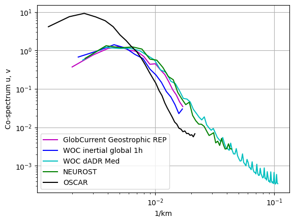
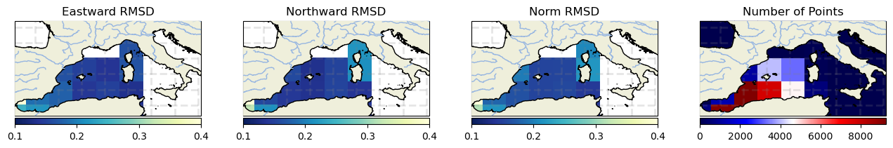
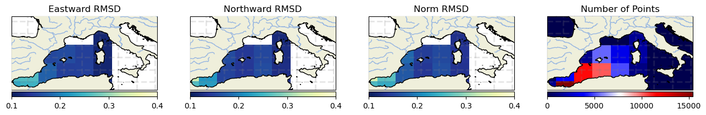
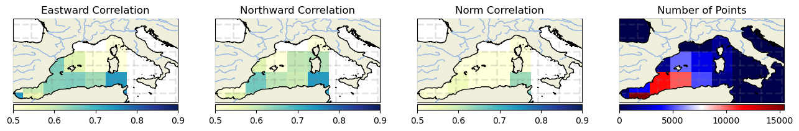
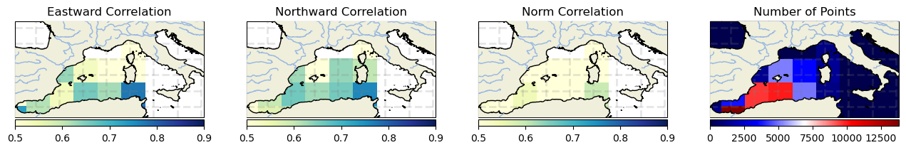
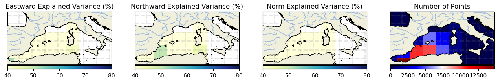
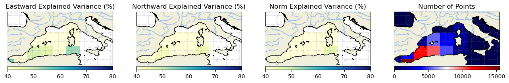
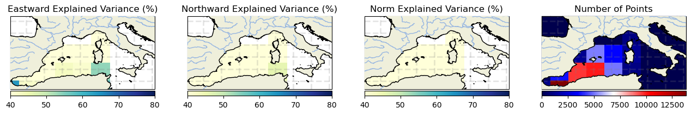
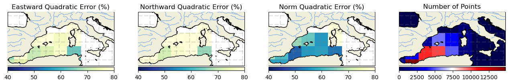
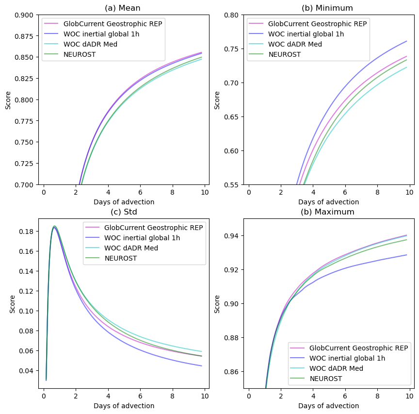

# Mediterranean Sea

 

 

<h1>
 <u> Mediterranean results </u> 
</h1>  

## <u> Compared products </u> 

<h3>
At 0m 
</h3> 
    <ul>  
        <li> <i>None</i></li> 
    </ul>  
<h3>
At 15m 
</h3> 
    <ul>  
        <li> GlobCurrent Geostrophic REP </li>   
        <li> WOC dADR-SR (dADR Med) </li>
        <li> WOC inertial global 15m </li>
        <li> NeurOST </li> 
        <li> OSCAR </li>
    </ul>  
 
  

 

 

<h2><u> 1. Spectrum </u></h2>

 

    
<h2> ▶️ At 15m</h2> 

 

 

 

 

<h1><u> 2. Eulerian RMS </u></h1>

 
    
<h2> ▶️ At 15m</h2>

 

 

<h3>Norm errors</h3>

<table width=100%>
<tr>
<td><b>Mean</b></td>
<td>Norm Quadratic Error (%)</td>
<td>Norm Correlation</td>
<td>Norm Explained Variance (%)</td>
<td>Norm RMSD</td>
<td>Number of Points</td>
</tr>
<tr>
<td><b>GlobCurrent Geostrophic</b></td>
<td>56.309</td>
<td>0.497</td>
<td>28.798</td>
<td>0.191</td>
<td>51875.000</td>
</tr>
<tr>
<td><b>WOC inertial global 15m</b></td>
<td>53.076</td>
<td>0.536</td>
<td>29.829</td>
<td>0.181</td>
<td>50604.000</td>
</tr>
<tr>
<td><b>WOC dADR-SR</b></td>
<td>55.884</td>
<td>0.499</td>
<td>36.801</td>
<td>0.190</td>
<td>50959.000</td>
</tr>
<tr>
<td><b>NeurOST</b></td>
<td>54.173</td>
<td>0.505</td>
<td>33.938</td>
<td>0.183</td>
<td>51823.000</td>
</tr>
</table>

 

<h3>Eastward errors</h3>

<table width=100%>
<tr>
<td><b>Mean</b></td>
<td>Eastward Quadratic Error (%)</td>
<td>Eastward Correlation</td>
<td>Eastward Explained Variance (%)</td>
<td>Eastward RMSD</td>
<td>Number of Points</td>
</tr>
<tr>
<td><b>GlobCurrent Geostrophic</b></td>
<td>74.536</td>
<td>0.632</td>
<td>33.899</td>
<td>0.191</td>
<td>51875.000</td>
</tr>
<tr>
<td><b>WOC inertial global 15m</b></td>
<td>69.579</td>
<td>0.625</td>
<td>33.552</td>
<td>0.179</td>
<td>50604.000</td>
</tr>
<tr>
<td><b>WOC dADR-SR</b></td>
<td>76.981</td>
<td>0.613</td>
<td>44.332</td>
<td>0.198</td>
<td>50959.000</td>
</tr>
<tr>
<td><b>NeurOST</b></td>
<td>76.845</td>
<td>0.595</td>
<td>42.369</td>
<td>0.197</td>
<td>51823.000</td>
</tr>
</table>

 

<h3>Northward errors</h3>

<table width=100%>
<tr>
<td><b>Mean</b></td>
<td>Northward Quadratic Error (%)</td>
<td>Northward Correlation</td>
<td>Northward Explained Variance (%)</td>
<td>Northward RMSD</td>
<td>Number of Points</td>
</tr>
<tr>
<td><b>GlobCurrent Geostrophic</b></td>
<td>80.777</td>
<td>0.633</td>
<td>39.746</td>
<td>0.179</td>
<td>51875.000</td>
</tr>
<tr>
<td><b>WOC inertial global 15m</b></td>
<td>76.659</td>
<td>0.655</td>
<td>37.399</td>
<td>0.171</td>
<td>50604.000</td>
</tr>
<tr>
<td><b>WOC dADR-SR</b></td>
<td>81.238</td>
<td>0.604</td>
<td>37.955</td>
<td>0.181</td>
<td>50959.000</td>
</tr>
<tr>
<td><b>NeurOST</b></td>
<td>80.824</td>
<td>0.625</td>
<td>36.793</td>
<td>0.179</td>
<td>51823.000</td>
</tr>
</table>

 

<h3>Standard deviation error</h3>

<table width=100%>
<tr>
<td><b>STD</b></td>
<td>Direction difference</td>
<td>Number of Points</td>
</tr>
<tr>
<td><b>GlobCurrent Geostrophic</b></td>
<td>41.196</td>
<td>51875.000</td>
</tr>
<tr>
<td><b>WOC inertial global 15m</b></td>
<td>41.756</td>
<td>50604.000</td>
</tr>
<tr>
<td><b>WOC dADR-SR</b></td>
<td>45.645</td>
<td>50959.000</td>
</tr>
<tr>
<td><b>NeurOST</b></td>
<td>43.640</td>
<td>51823.000</td>
</tr>
</table>

 

<h3>Binned plots</h3>

    
    

 
<b>Results for diagnostic RMSD</b>

<b>GlobCurrents Total</b>

<b>WOC inertial global 15m</b>

<b>WOC dADR-SR</b>

<b>NeurOST</b>

    
    

 
<b>Results for diagnostic Correlation</b>

<b>GlobCurrents Total</b>

<b>WOC inertial global 15m</b>

<b>WOC dADR-SR</b>

<b>NeurOST</b>

    
    

 
<b>Results for diagnostic Explained Variance (%)</b>

<b>GlobCurrents Total</b>

<b>WOC inertial global 15m</b>

<b>WOC dADR-SR</b>

<b>NeurOST</b>

    
    

 
<b>Results for diagnostic Quadratic Error (%)</b>

<b>GlobCurrents Total</b>

<b>WOC inertial global 15m</b>

<b>WOC dADR-SR</b>

<b>NeurOST</b>

 

 

<h1><u> 3. Lagrangian Cumulative Distance</u></h1>

    
<h2> ▶️ At 15m</h2>

 

    <Figure size 640x480 with 0 Axes>

 

 

 
