# Product comparison

 

 

<h1>
 <u> Mediterranean results </u> 
</h1>  

## <u> Compared products </u> 

<h3>
    At 00m 
      
    <ul>  
        <li> <i>None</i></li> 
    </ul>  
     
    At 15m 
     
    <ul>  
        <li> GlobCurrent Geostrophic REP </li>   
        <li> WOC dADR-SR (dADR Med) </li>
        <li> WOC inertial global 15m </li>
        <li> NeurOST </li> 
    </ul>  

</h3>
  

 

 

## <u> 1. Spectrum </u> 

 

<h2>At 15m</h2>

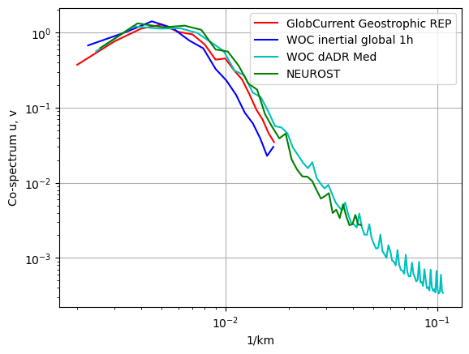

 

 

## <u> 2. Eulerian RMS </u>

 

<h2>At 15m</h2>

 

<h3>Mean error</h3>

<table width=100%>
<tr>
<td><b>Mean</b></td>
<td>Norm Quadratic Error (%)</td>
<td>Norm Correlation</td>
<td>Norm Explained Variance (%)</td>
<td>Norm RMSD</td>
<td>Number of Points</td>
</tr>
<tr>
<td><b>GlobCurrent Geostrophic</b></td>
<td>56.309</td>
<td>0.497</td>
<td>28.798</td>
<td>0.191</td>
<td>51875.000</td>
</tr>
<tr>
<td><b>WOC inertial global 15m</b></td>
<td>53.076</td>
<td>0.536</td>
<td>29.829</td>
<td>0.181</td>
<td>50604.000</td>
</tr>
<tr>
<td><b>WOC dADR-SR</b></td>
<td>55.884</td>
<td>0.499</td>
<td>36.801</td>
<td>0.190</td>
<td>50959.000</td>
</tr>
<tr>
<td><b>NeurOST</b></td>
<td>54.173</td>
<td>0.505</td>
<td>33.938</td>
<td>0.183</td>
<td>51823.000</td>
</tr>
</table>

 

 

<h3>Standard deviation error</h3>

<table width=100%>
<tr>
<td><b>STD</b></td>
<td>Direction difference</td>
<td>Number of Points</td>
</tr>
<tr>
<td><b>GlobCurrent Geostrophic</b></td>
<td>41.196</td>
<td>51875.000</td>
</tr>
<tr>
<td><b>WOC inertial global 15m</b></td>
<td>41.756</td>
<td>50604.000</td>
</tr>
<tr>
<td><b>WOC dADR-SR</b></td>
<td>45.645</td>
<td>50959.000</td>
</tr>
<tr>
<td><b>NeurOST</b></td>
<td>43.640</td>
<td>51823.000</td>
</tr>
</table>

 

<h3>Binned plots</h3>

    
    

<b>Results for diagnostic RMSD</b>

<b>GlobCurrents Total<b>

<b>WOC inertial global 15m<b>

<b>WOC dADR-SR<b>

<b>NeurOST<b>

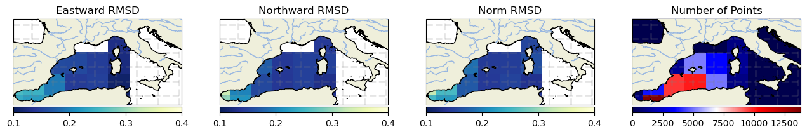

    
    

<b>Results for diagnostic Correlation</b>

<b>GlobCurrents Total<b>

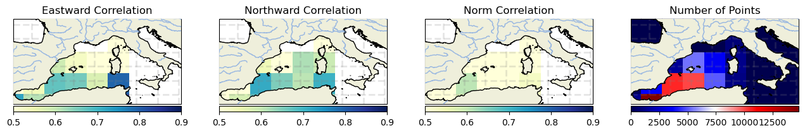

<b>WOC inertial global 15m<b>

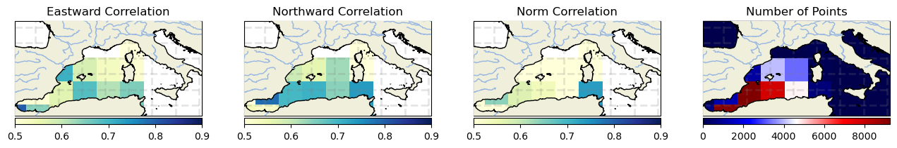

<b>WOC dADR-SR<b>

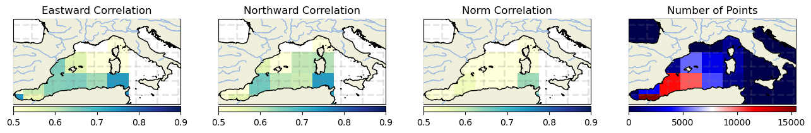

<b>NeurOST<b>

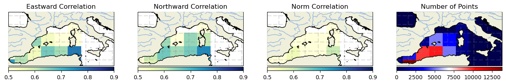

    
    

<b>Results for diagnostic Explained Variance (%)</b>

<b>GlobCurrents Total<b>

<b>WOC inertial global 15m<b>

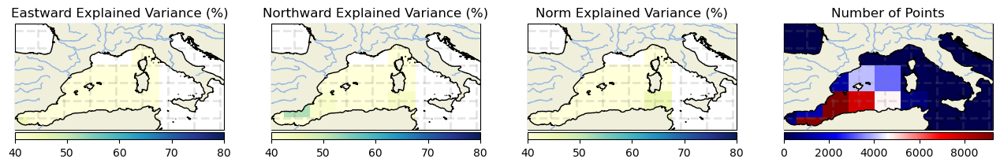

<b>WOC dADR-SR<b>

<b>NeurOST<b>

    
    

<b>Results for diagnostic Quadratic Error (%)</b>

<b>GlobCurrents Total<b>

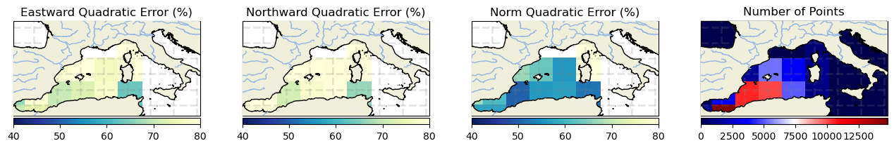

<b>WOC inertial global 15m<b>

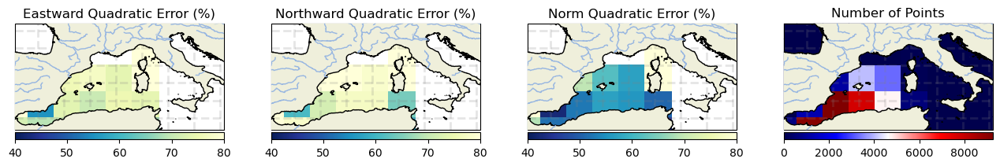

<b>WOC dADR-SR<b>

<b>NeurOST<b>

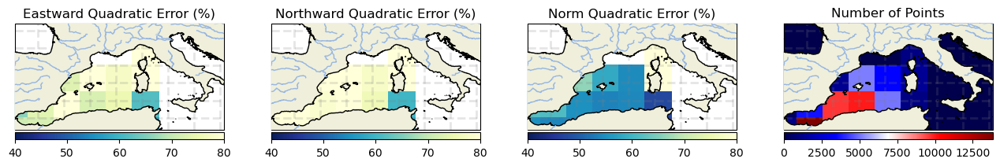

 

 

## <u> 3. Lagrangian Cumulative Distance</u>

 

<h2>At 15m</h2>

    <Figure size 640x480 with 0 Axes>

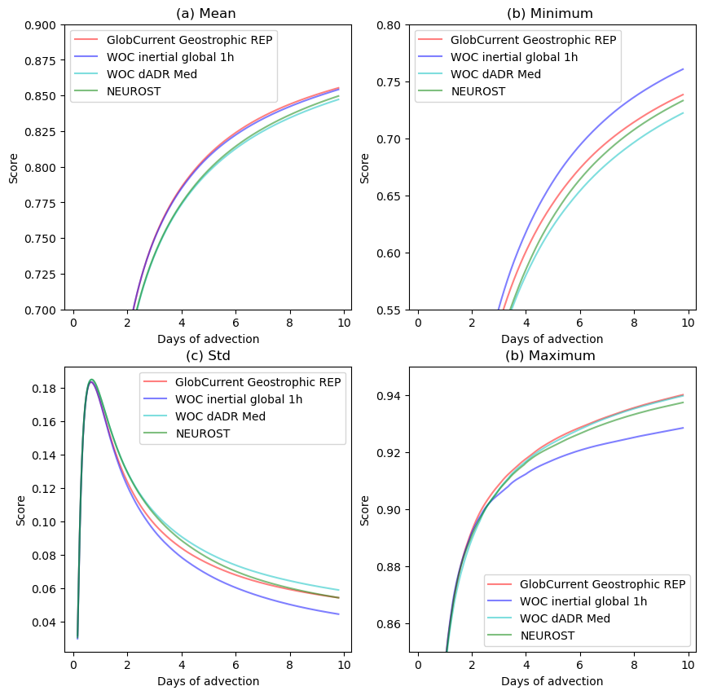

