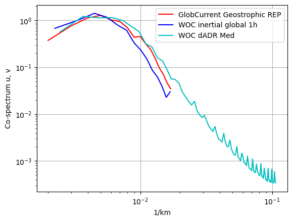

# Product comparison

 

 

<h1>
 <u> Mediterranean results </u> 
</h1>  
    

## <u> Compared products </u> 

<h3>
    <ul>  
        <li> GlobCurrent Geostrophic REP </li>  
        <li> WOC BFN-QG </li>
        <li> WOC inertial global </li>
        <li> WOC dADR-SR (dADR Med) </li>
    </ul>  

</h3>

    <Figure size 640x480 with 0 Axes>

    <Figure size 640x480 with 0 Axes>

    <Figure size 640x480 with 0 Axes>

    <Figure size 640x480 with 0 Axes>

    <Figure size 640x480 with 0 Axes>

 

 

## <u> 1. Spectrum </u> 

 

<h2>At 0m</h2>

 

<h2>At 15m</h2>

 

 

## <u> 2. Eulerian RMS </u>

 

<h2>At 0m</h2>

 

<h3>Mean error</h3>

<table width=100%>
<tr>
<td><b>Mean</b></td>
<td>Norm Quadratic Error (%)</td>
<td>Norm Explained Variance (%)</td>
<td>Norm Correlation</td>
<td>Norm RMSD</td>
<td>Number of Points</td>
</tr>
<tr>
<td><b>GlobCurrent Geostrophic</b></td>
<td>55.482</td>
<td>56.379</td>
<td>0.541</td>
<td>0.194</td>
<td>13721.000</td>
</tr>
<tr>
<td><b>WOC inertial global 1h</b></td>
<td>50.868</td>
<td>53.370</td>
<td>0.615</td>
<td>0.180</td>
<td>14100.000</td>
</tr>
<tr>
<td><b>WOC dADR-SR</b></td>
<td>54.258</td>
<td>66.912</td>
<td>0.518</td>
<td>0.191</td>
<td>13951.000</td>
</tr>
</table>

 

 

<h3>Standard deviation error</h3>

<table width=100%>
<tr>
<td><b>STD</b></td>
<td>Direction difference</td>
<td>Number of Points</td>
</tr>
<tr>
<td><b>GlobCurrent Geostrophic</b></td>
<td>44.383</td>
<td>13721.000</td>
</tr>
<tr>
<td><b>WOC inertial global 1h</b></td>
<td>44.461</td>
<td>14100.000</td>
</tr>
<tr>
<td><b>WOC dADR-SR</b></td>
<td>47.691</td>
<td>13951.000</td>
</tr>
</table>

 

<h2>At 15m</h2>

 

<h3>Mean error</h3>

<table width=100%>
<tr>
<td><b>Mean</b></td>
<td>Norm Quadratic Error (%)</td>
<td>Norm Explained Variance (%)</td>
<td>Norm Correlation</td>
<td>Norm RMSD</td>
<td>Number of Points</td>
</tr>
<tr>
<td><b>GlobCurrent Geostrophic</b></td>
<td>56.225</td>
<td>57.278</td>
<td>0.498</td>
<td>0.191</td>
<td>49776.000</td>
</tr>
<tr>
<td><b>WOC inertial global 1h</b></td>
<td>53.076</td>
<td>51.053</td>
<td>0.536</td>
<td>0.181</td>
<td>50604.000</td>
</tr>
<tr>
<td><b>WOC dADR-SR</b></td>
<td>55.884</td>
<td>73.336</td>
<td>0.499</td>
<td>0.190</td>
<td>50959.000</td>
</tr>
</table>

 

 

<h3>Standard deviation error</h3>

<table width=100%>
<tr>
<td><b>STD</b></td>
<td>Direction difference</td>
<td>Number of Points</td>
</tr>
<tr>
<td><b>GlobCurrent Geostrophic</b></td>
<td>41.229</td>
<td>49776.000</td>
</tr>
<tr>
<td><b>WOC inertial global 1h</b></td>
<td>41.756</td>
<td>50604.000</td>
</tr>
<tr>
<td><b>WOC dADR-SR</b></td>
<td>45.643</td>
<td>50959.000</td>
</tr>
</table>

 

 

## <u> 3. Lagrangian Cumulative Distance</u>

 

<h2>At 0m</h2>

    <Figure size 640x480 with 0 Axes>

 

<h2>At 15m</h2>

    <Figure size 640x480 with 0 Axes>

 

 

## <u>4. Fronts and currents consistency</u>

    please provide statistics file ../dc_data/DC_product_evaluation/fronts_vel_comparison/config_fronts.json
    please provide statistics file ../dc_data/DC_product_evaluation/fronts_vel_comparison/config_fronts.json
    please provide statistics file ../dc_data/DC_product_evaluation/fronts_vel_comparison/config_fronts.json

    An exception has occurred, use %tb to see the full traceback.

    SystemExit: 1

    please provide statistics file ../dc_data/DC_product_evaluation/fronts_vel_comparison/config_fronts.json
    please provide statistics file ../dc_data/DC_product_evaluation/fronts_vel_comparison/config_fronts.json
    please provide statistics file ../dc_data/DC_product_evaluation/fronts_vel_comparison/config_fronts.json

    An exception has occurred, use %tb to see the full traceback.

    SystemExit: 1

