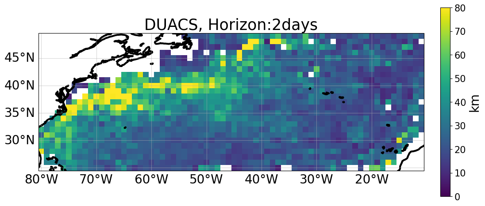

# MIOST geostrophic currents  

 

Multi-scale interpolation (MIOST) combines ocean altimetry data along the track into continuous grids in time and space. Like the DUACS mapping system, it is based on a linear optimal interpolation scheme, with a different level of definition of the covariance functions. For this experimental product, only covariance functions representative of mesoscale geostrophic variability have been taken into account.

 

## Current magnitud movie 
   
 

<video controls width="600">
  <source src="https://github.com/ocean-data-challenges/2024_DC_WOC-ESA/assets/33433820/b6f7afa5-8e8c-495b-a522-9064c9ecd47f" type="video/mp4" />  
</video>

 

 
 

 

## Zonal and Meridional current error and explained variance
 

|  | 
|   |
|----|

 
 

 

## Lagrangian cumulative distance 

|  |  |  |  |  |
|--|--|--|--|--|

   
  