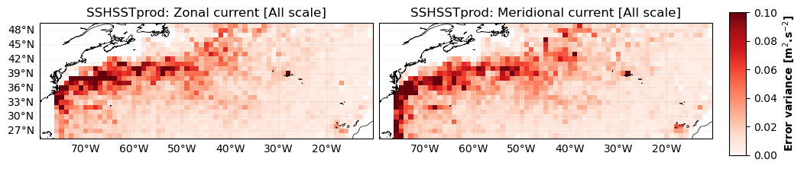
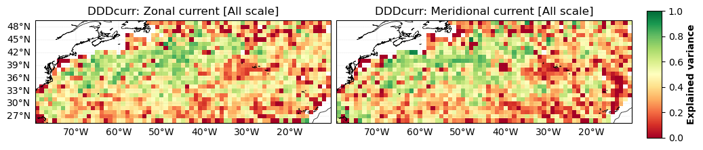
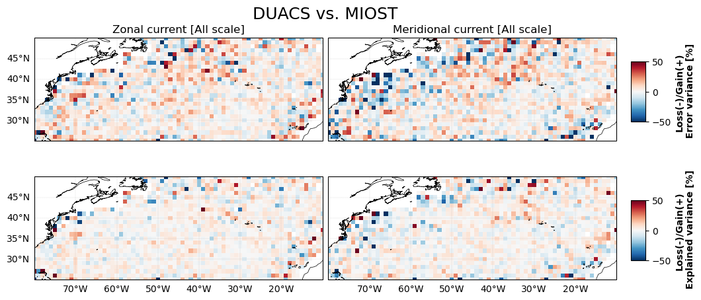
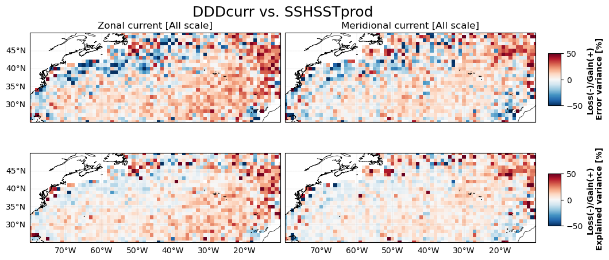
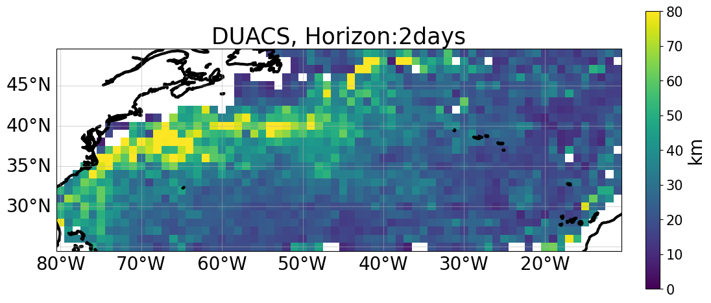
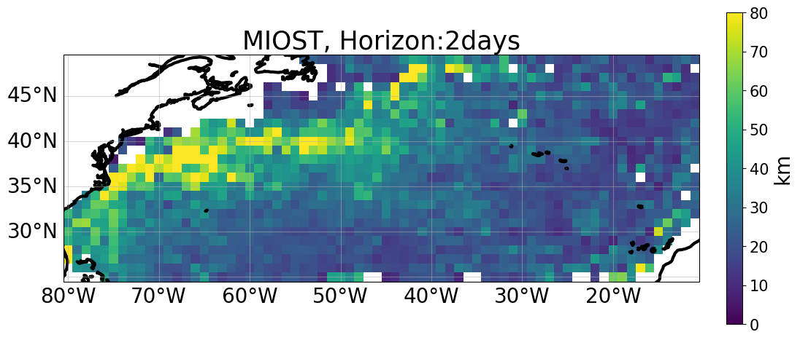
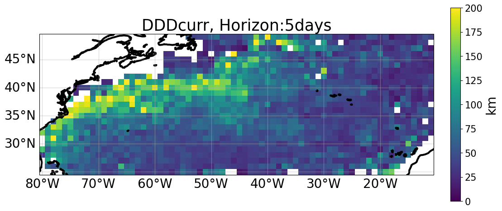

# Overall comparison

 
 

## Current magnitud movie 
 

<video controls width="1000">
  <source src="https://github.com/ocean-data-challenges/2024_DC_WOC-ESA/assets/33433820/0dd433a6-f98d-46bd-b44f-0a0f5662164a" type="video/mp4" />  
</video>

 
 

 

## Zonal and Meridional current errors  
 
|  |  | 
|----|----| 
  |  |  

## Zonal and Meridional current explained variances
  
|   |     |
|----|----| 
     |   |

 

## Zonal and Meridional current error and explained variance comparison

    

        
        
    
 

 
    

        
          
    

 

## Lagrangian cumulative distance comparison

 
|  |  |  |  |  |
|--|--|--|--|--| 
|  |  |  |  |  |
|  |  |  |  |  | 
|  |  |  |  |  | 
 

  
 
   
  