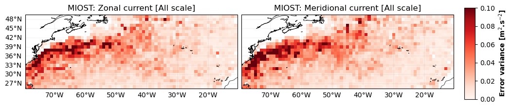
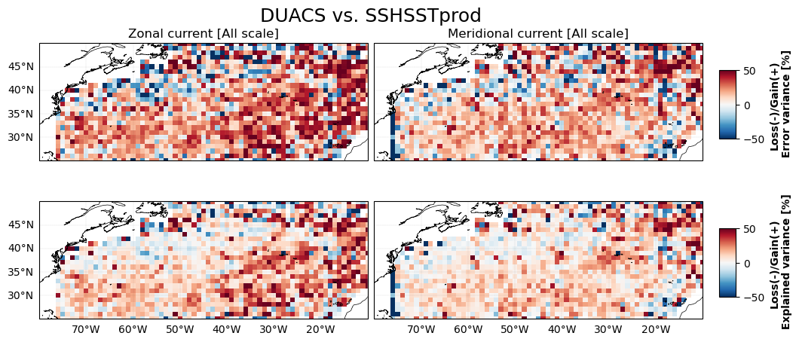
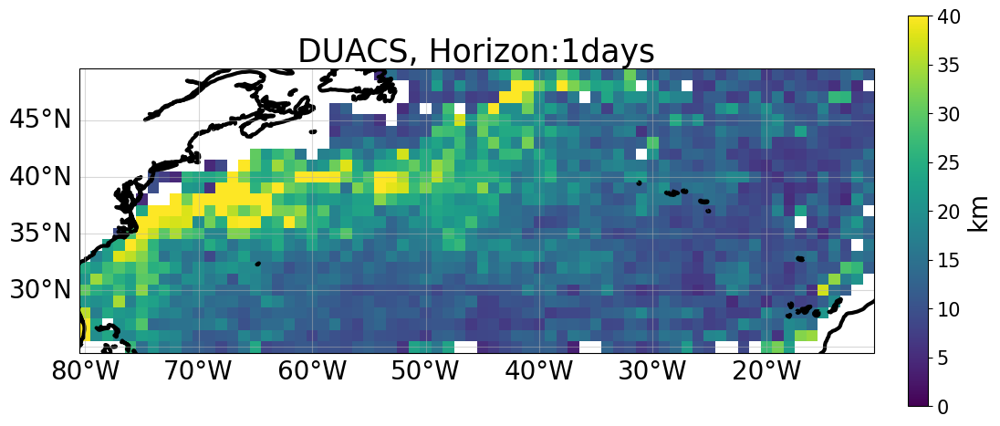
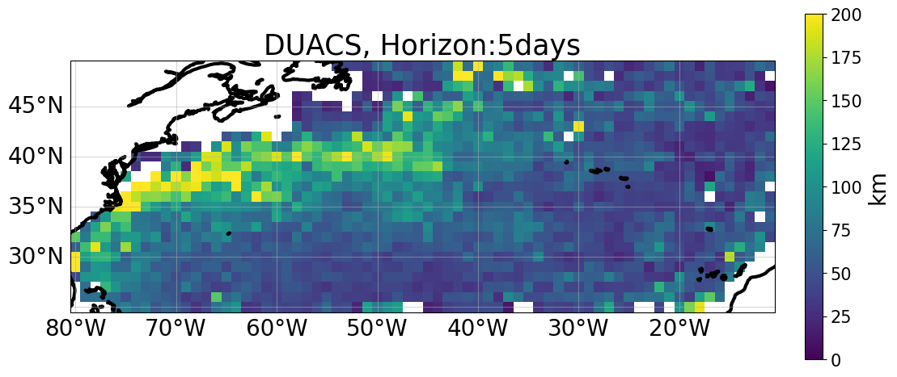
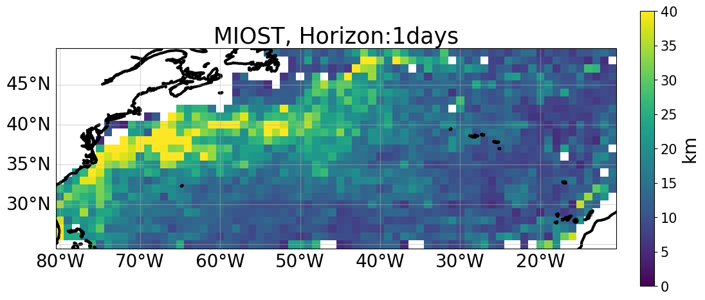
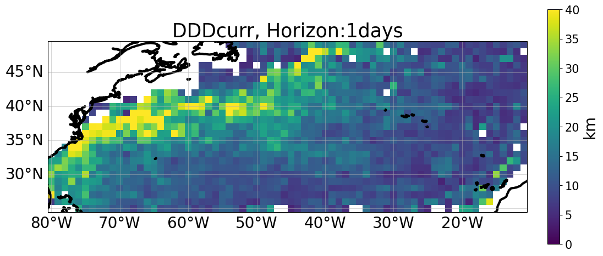
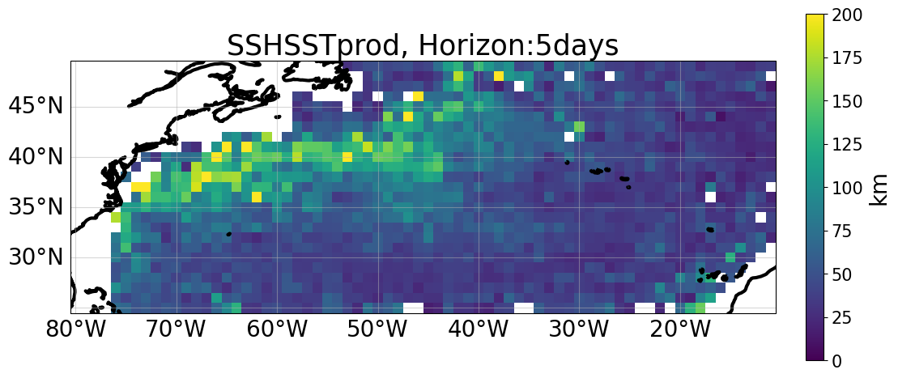

# Overall comparison

 
 
    
## Metric boards

Variance error [m²/s²] ⤵️  

    
  

| Region| Method| Variance error u [m²/s²] | Variance error v [m²/s²]  | 
|---|---|---|---| 
|**coastal**         |**DUACS**      | 0.026835     |  0.027367    |  
|                    |**MIOST**      | 0.026970     | 0.028193     |  
|                    |**DDDcurr**    | 0.025531     | 0.027564     | 
|                    |**SSHSSTprod** | 0.017744     | 0.028912     |  
|||| 
|**offshore_highvar**|**DUACS**      | 0.049405     | 0.048346     |  
|                    |**MIOST**      | 0.048746     | 0.049801     | 
|                    |**DDDcurr**    | 0.053595     | 0.051306     |  
|                    |**SSHSSTprod** | 0.047787     | 0.047780     | 
|||| 
|**offshore_lowvar** |**DUACS**      | 0.018048     | 0.015990     |  
|                    |**MIOST**      | 0.017930     | 0.015888     | 
|                    |**DDDcurr**    | 0.016065     | 0.015166     | 
|                    |**SSHSSTprod** | 0.013400     | 0.013444     | 

 
 

Error scores ⤵️  

    
  

| Region| Method  | Error score u | Error score v |
|---|---|---|---| 
|**coastal**         |**DUACS**      | 54.2 %     | 66.2 % |  
|                    |**MIOST**      | 54.0 %     | 65.2     |  
|                    |**DDDcurr**    | 56.9 %     | 64.9     | 
|                    |**SSHSSTprod** | 60.4 % | 43.4     |  
|||| 
|**offshore_highvar**|**DUACS**      | 72.7 %     | 67.7 %     |  
|                    |**MIOST**      | 73.1 %     | 66.7 %     | 
|                    |**DDDcurr**    | 70.4 %     | 65.7 %     |  
|                    |**SSHSSTprod** | 73.6 % | 68.1 % | 
|||| 
|**offshore_lowvar** |**DUACS**      | 39.9 %     | 41.7 %     |  
|                    |**MIOST**      | 40.4 %     | 42.1 %     | 
|                    |**DDDcurr**    | 46.6 %     | 44.7 %     | 
|                    |**SSHSSTprod** | 54.6 % | 50.1 % | 

  

 

 

## Current magnitud movie 
 

Current movies ⤵️  

  

<video controls width="1000">
  <source src="https://github.com/ocean-data-challenges/2024_DC_WOC-ESA/assets/33433820/0dd433a6-f98d-46bd-b44f-0a0f5662164a" type="video/mp4" />  
</video>

 

 

 

## Current errors  
 

Zonal and Meridional current error variances ⤵️  

  

|  |  | 
|----|----| 
  |  |  

 

 

## Current explained variances
  

Zonal and Meridional current explained variances ⤵️  

  

|   |     |
|----|----| 
     |   |

 

 

## Current comparison

Zonal and Meridional current error and explained variance comparison ⤵️  

  

    

        
        
    
 

 
  
  

 
    

        
          
    

 

 

## Lagrangian cumulative distance comparison

LCD maps ⤵️  

  
 
|  |  |  |  |  |
|--|--|--|--|--| 
|  |  |  |  |  |
|  |  |  |  |  | 
|  |  |  |  |  | 
 

 
  

LCD temporal horizon series ⤵️  

  

  
 

   
  