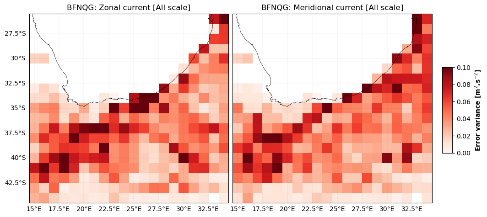
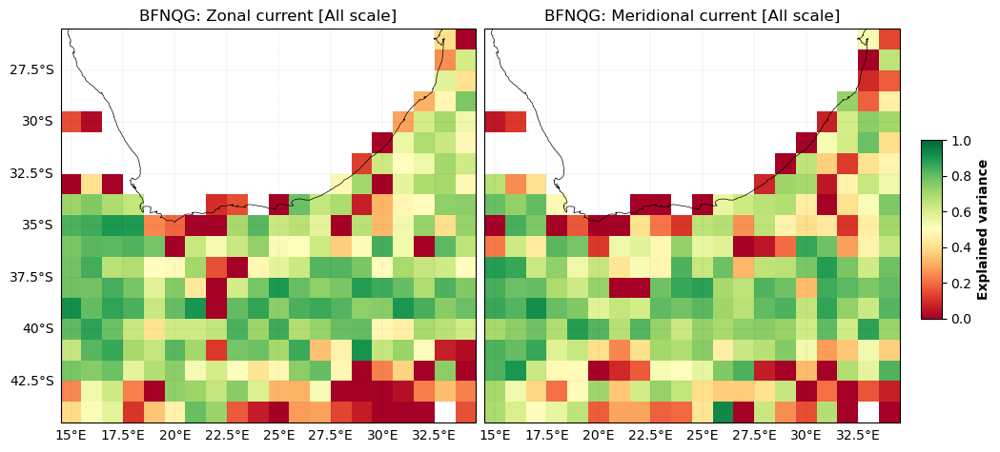
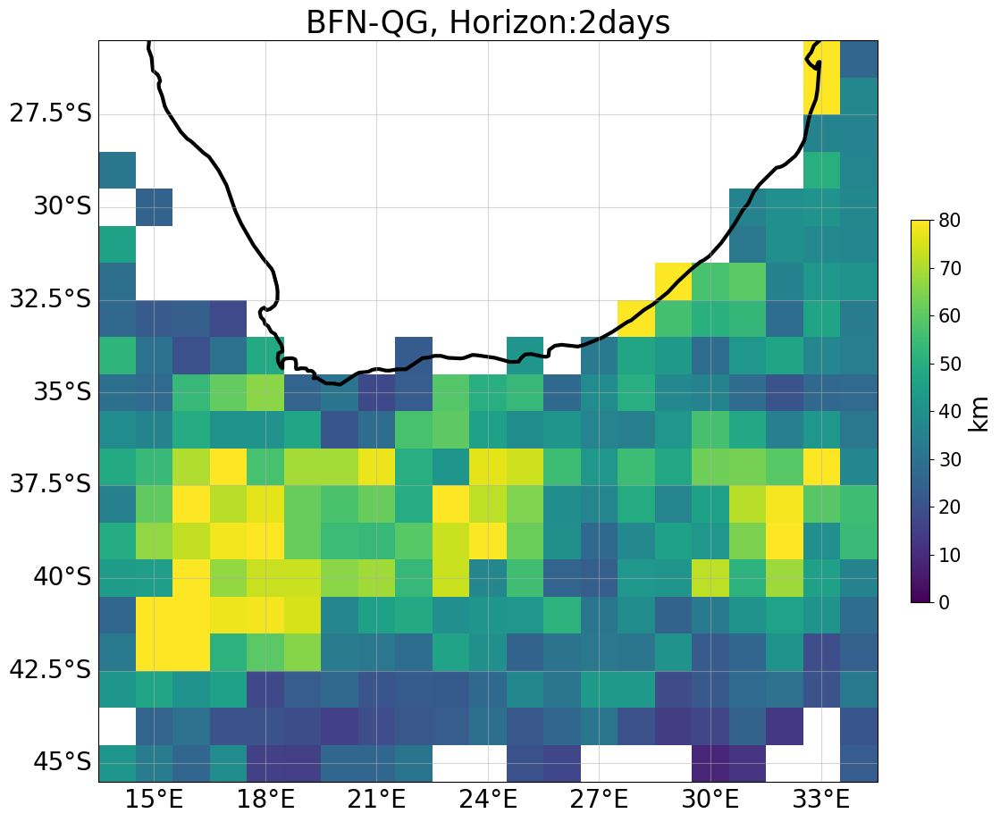

# WOC - BFN-QG geostrophic currents  

 
 
**More information on the BFN-QG products [here](https://www.worldoceancirculation.org/Products#/metadata/7fe77c80-798a-42d4-a69c-2b5f0ba81a43) !**

   

## Current magnitud movie 

<video controls width="600">
  <source src="https://github.com/ocean-data-challenges/2024_DC_WOC-ESA/assets/33433820/1303fb3f-8d34-4d4a-93bb-27dd91919cfb" type="video/mp4" /> 
  
</video>

<!---
<video controls width="400">
  <source src="https://github.com/ocean-data-challenges/2024_DC_WOC-ESA/assets/33433820/5c124187-ecac-4f88-85b5-68ba0ee88a2c" type="video/mp4" /> 
</video>
-->

 

## Zonal and Meridional current error variance

 

 

## Zonal and Meridional current explained variance
 

 

## Lagrangian cumulative distance 

|  |  |  |  |  |
|--|--|--|--|--|

   
  