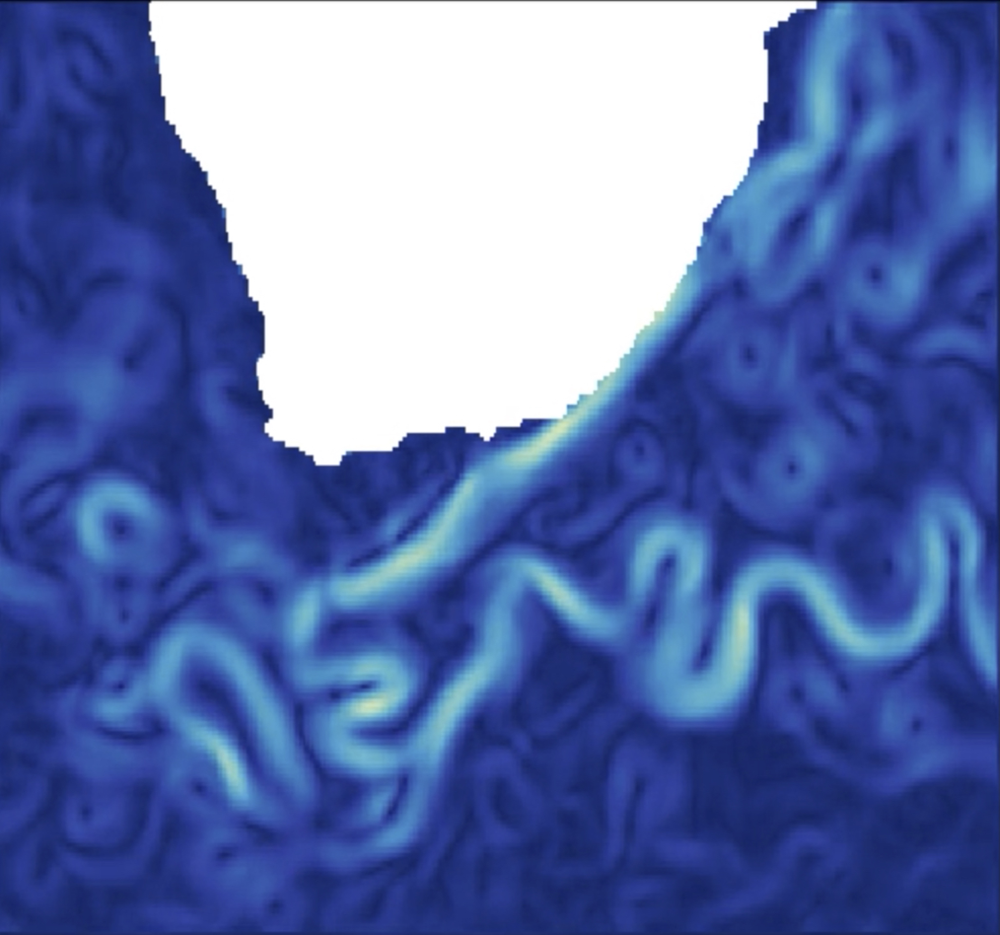

# Agulhas current setup

 

 
## Area  

- Longitude minimum: 14°E
- Longitude maximum: 35°E
- Latitude minimum: 45°S
- Latitude maximum: 30°S

  

 

## Dynamical specificities: Strongly geostrophic region. 
    
## WOC products: Drifter data-driven currents, BFN-QG geostrophic currents, Doppler currents

 
 