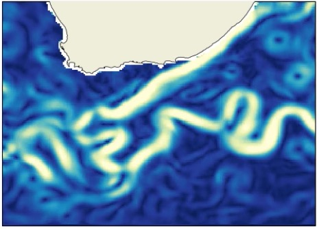

# Agulhas current setup

 

 

  

 

 
## Period 

- **Year 2019** 
 
## Area  

- Longitude minimum: 14°E
- Longitude maximum: 35°E
- Latitude minimum: 45°S
- Latitude maximum: 30°S

## Dynamical specificities: 

Strongly geostrophic region. 

## Observations available for mapping currents 

- conventional nadir altimeters 
   - Saral-Altika (alg)
   - Cryosat-2 (c2)
   - Haiyang-2a (h2ag)
   - Haiyang-2b (h2b)
   - Jason-3 (j3)
   - Sentinel-3a (s3a)
   - Sentinel-3b (s3b)
    
## Independant evaluation data  

- CMEMS drifters currents and trajectories.

## Products: 
<ul>  
    <li> WOC BFN-QG </li> 
    <li> WOC Global Inertial </li> 
    <li> GlobCurrent Geostrophic </li>
    <li> GlobCurrent Total </li>
</ul>

 
 