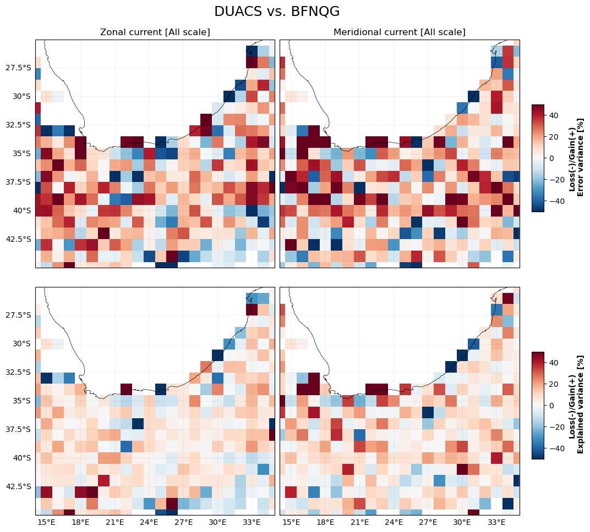
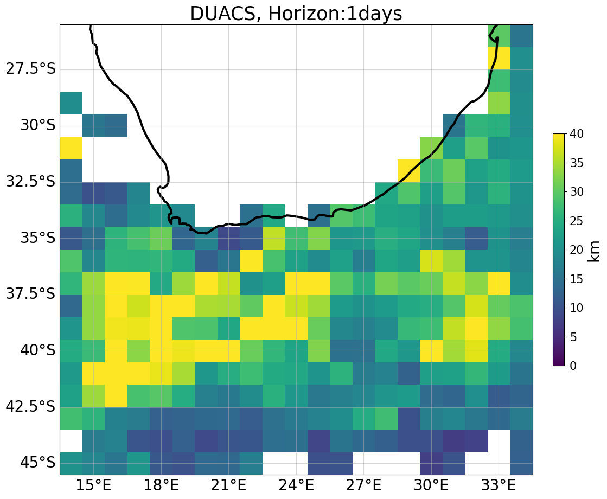
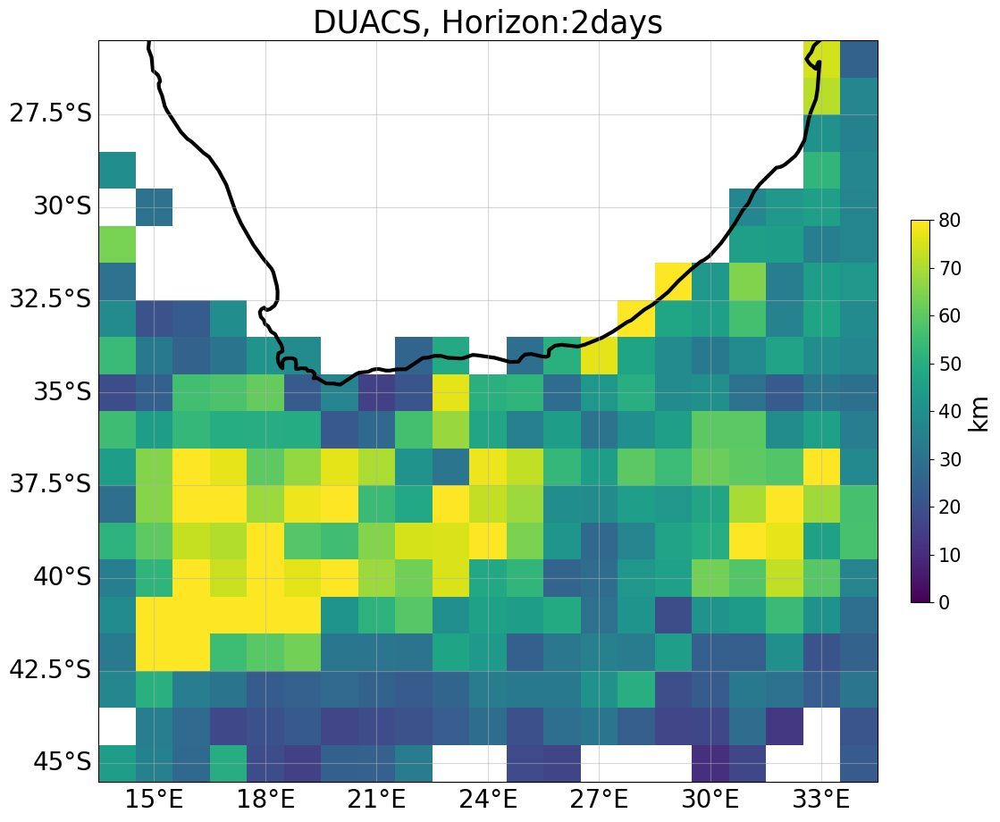
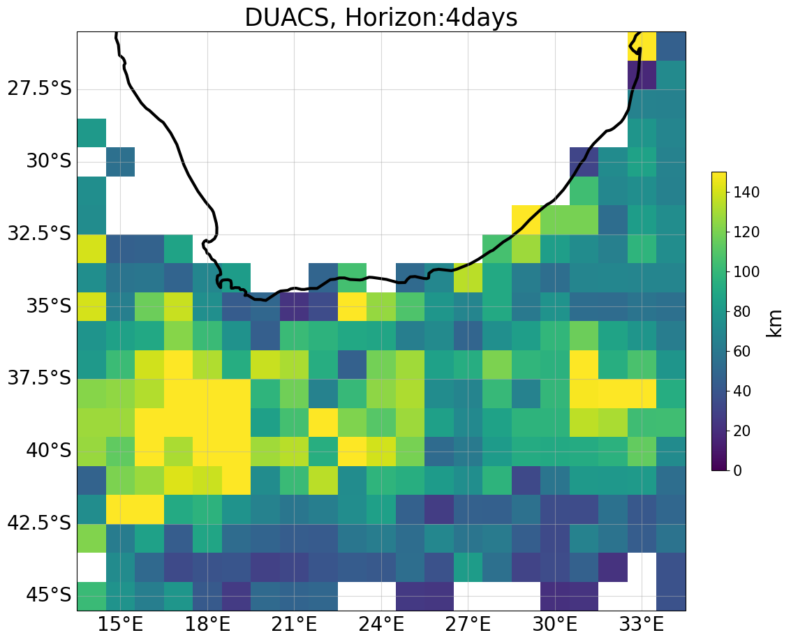
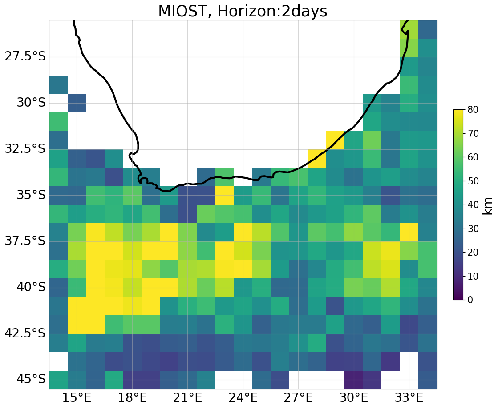
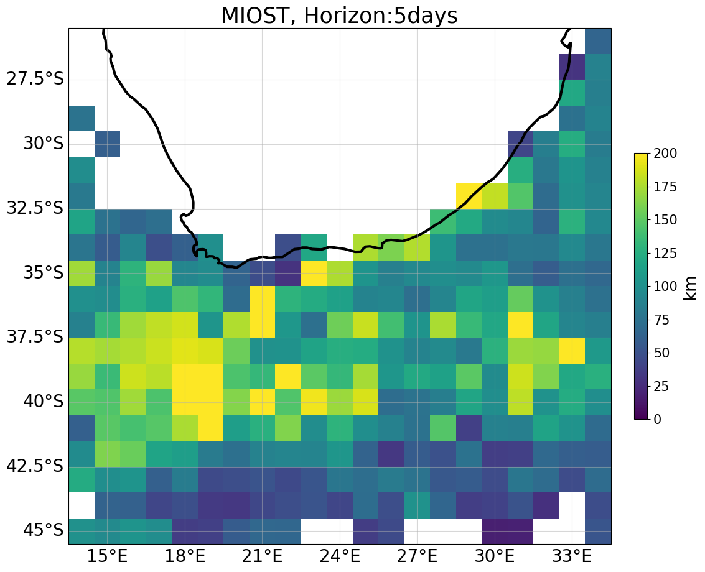

# Overall comparison

 
 
    
## Metric boards

Variance error [m²/s²] ⤵️  

    
   

| Region| Method| Variance error u [m²/s²] | Variance error v [m²/s²]  | 
|---|---|---|---| 
|**coastal**|**DUACS** | 0.051408 |  0.055813 |  
||**MIOST** | 0.049734 | 0.058365 |  
||**BFN-QG** | 0.051588 | 0.051550 |  
|||| 
|**offshore_highvar**|**DUACS** | 0.048399 | 0.051483 |  
| |**MIOST**| 0.048318 | 0.052196 | 
|  |**BFN-QG**| 0.043017 | 0.044031 |  
|||| 
|**offshore_lowvar** |**DUACS** | 0.023910 | 0.021734 |  
||**MIOST**| 0.023864 | 0.021658 | 
|  |**BFN-QG**| 0.024237 | 0.021606 | 

 

 

Error scores ⤵️  

    
  

| Region| Method  | Error score u | Error score v |
|---|---|---|---| 
|**coastal**|**DUACS**  | 72.3 % | 67.1 % | 
||**MIOST** | 72.8 % | 64.3 % | 
||**BFN-QG** | 72.0 % | 68.5 % | 
|||| 
|**offshore_highvar** |**DUACS** | 73.3 % | 68.4 % |
||**MIOST**|  73.3 % | 68.0 % |
|  |**BFN-QG**| 76.3 % | 73.0 % |
|||| 
|**offshore_lowvar** |**DUACS** | 54.5 % | 53.7 % |  
||**MIOST**| 54.6 % | 53.9 % | 
|  |**BFN-QG**| 53.9 % | 54.0 % |

  

 

 
    
## Current magnitud movie 
 

Current movies ⤵️  

    
  

<video controls width="1000">
  <source src="https://github.com/ocean-data-challenges/2024_DC_WOC-ESA/assets/33433820/fd1da4bc-8b6f-447f-b04d-e9ea523e1162" type="video/mp4" />  
</video>

   

 

 

## Current error comparison
 

Zonal and Meridional current error and explained variance comparison ⤵️  

  

    

        
        
    

    

         
    

 

 

## Lagrangian cumulative distance comparison

LCD maps ⤵️  

  

|  |  |  |  |  |
|--|--|--|--|--|
|  |  |  |  |  |
|  |  |  |  |  |

 

 
  

LCD temporal horizon series ⤵️  

  

  
 

   
  