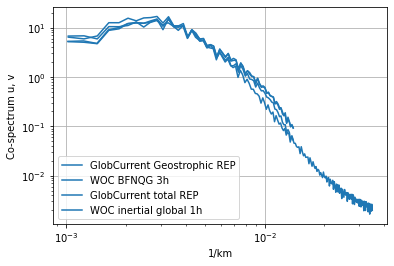
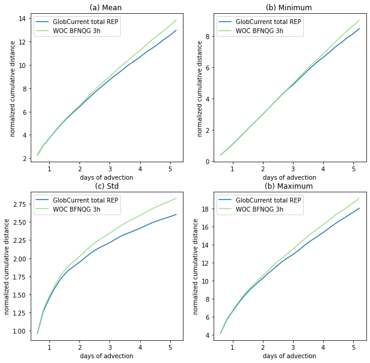
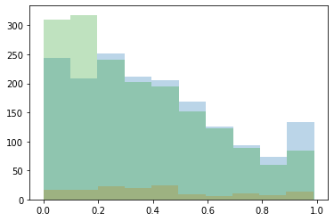

# Product comparison

 

 

<h1>
 <u> Agulhas results </u> 
</h1>  
    

## <u> Compared products </u> 

<h3>
    <ul>  
        <li> GlobCurrent Geostrophic REP </li> 
        <li> GlobCurrent Total REP </li>
        <li> WOC BFN-QG </li>
        <li> WOC inertial global </li>
    </ul>  

</h3>

 

 

## <u> 1. Spectrum </u> 

 

 

 

## <u> 2. Eulerian RMS </u>

 

<h3>Mean error</h3>

<table width=100%>
<tr>
<td><b>Mean</b></td>
<td>Eastward error</td>
<td>Northward error</td>
<td>Norm error</td>
<td>Direction error</td>
<td>Eastward speed</td>
<td>Northward speed</td>
<td>Field speed</td>
<td>Drifter speed</td>
<td>percentage</td>
</tr>
<tr>
<td><b>GlobCurrents Geostrophic</b></td>
<td>0.185</td>
<td>0.175</td>
<td>0.181</td>
<td>84.718</td>
<td>0.328</td>
<td>0.318</td>
<td>0.467</td>
<td>0.543</td>
<td>38.514</td>
</tr>
<tr>
<td><b>GlobCurrents Total</b></td>
<td>0.166</td>
<td>0.169</td>
<td>0.166</td>
<td>77.047</td>
<td>0.362</td>
<td>0.325</td>
<td>0.495</td>
<td>0.554</td>
<td>34.434</td>
</tr>
<tr>
<td><b>BFN-QG</b></td>
<td>0.179</td>
<td>0.180</td>
<td>0.183</td>
<td>95.679</td>
<td>0.335</td>
<td>0.323</td>
<td>0.467</td>
<td>0.542</td>
<td>40.735</td>
</tr>
</table>

 

 

<h3>Standard deviation error</h3>

<table width=100%>
<tr>
<td><b>std</b></td>
<td>Eastward error</td>
<td>Northward error</td>
<td>Norm error</td>
<td>Direction error</td>
<td>Eastward speed</td>
<td>Northward speed</td>
<td>Field speed</td>
<td>Drifter speed</td>
<td>percentage</td>
</tr>
<tr>
<td><b>GlobCurrents Geostrophic</b></td>
<td>0.117</td>
<td>0.112</td>
<td>0.118</td>
<td>64.674</td>
<td>0.326</td>
<td>0.317</td>
<td>0.290</td>
<td>0.298</td>
<td>0.212</td>
</tr>
<tr>
<td><b>GlobCurrents Total</b></td>
<td>0.109</td>
<td>0.110</td>
<td>0.110</td>
<td>60.797</td>
<td>0.355</td>
<td>0.325</td>
<td>0.288</td>
<td>0.299</td>
<td>0.192</td>
</tr>
<tr>
<td><b>BFN-QG</b></td>
<td>0.113</td>
<td>0.114</td>
<td>0.116</td>
<td>75.547</td>
<td>0.334</td>
<td>0.322</td>
<td>0.287</td>
<td>0.291</td>
<td>0.226</td>
</tr>
</table>

 

 

## <u> 3. Lagrangian Cumulative Distance </u>

    <Figure size 432x288 with 0 Axes>

 

 

## <u>4. Fronts and currents consistency</u>

    ---------------------------------------------------------------------------

    KeyError                                  Traceback (most recent call last)

    <ipython-input-9-01bed2301577> in <module>()
          3 outputfilename = 'SDE_region_T1.png'
          4 
    ----> 5 _ = sde.plot(list_sde, output_dir=outputdir, output_filename=outputfilename)
    

    ~/Documents/DataChallenges/Metrics_package/velocity_metrics/velocity_metrics/lagrangian/cumulative_distance.py in plot(list_pickle, output_dir, output_filename)
         48          output_filename: Optional[str] = 'Sde.png'):
         49     outfile = os.path.join(output_dir, output_filename)
    ---> 50     plot_all_sde(list_pickle, outfile)
         51 
         52 

    ~/Documents/DataChallenges/Metrics_package/velocity_metrics/velocity_metrics/lagrangian/cumulative_distance.py in plot_all_sde(list_pickle_sde, fileout)
         63         with open(ifile, 'rb') as f:
         64             dic = pickle.load(f)
    ---> 65         dic_mean = average_sde(dic)
         66         if 'color' not in dic_mean.keys():
         67             dic_mean['color'] = col

    ~/Documents/DataChallenges/Metrics_package/velocity_metrics/velocity_metrics/lagrangian/cumulative_distance.py in average_sde(dic, list_stat, list_attr)
        116         i += 1
        117     for key in list_stat:
    --> 118         dic_arr[key] = dic_arr[key] / i
        119     return dic_arr
        120 

    KeyError: 'meansde'

    332
    14
    332
    8.937580441379338e-05
    0.002086119946779534

    ERROR LENGTH 72165 4656
    ERROR LENGTH 72165 4656
    ERROR LENGTH 72165 4656

    6.192268438138431e-05

    An exception has occurred, use %tb to see the full traceback.

    SystemExit: 1

